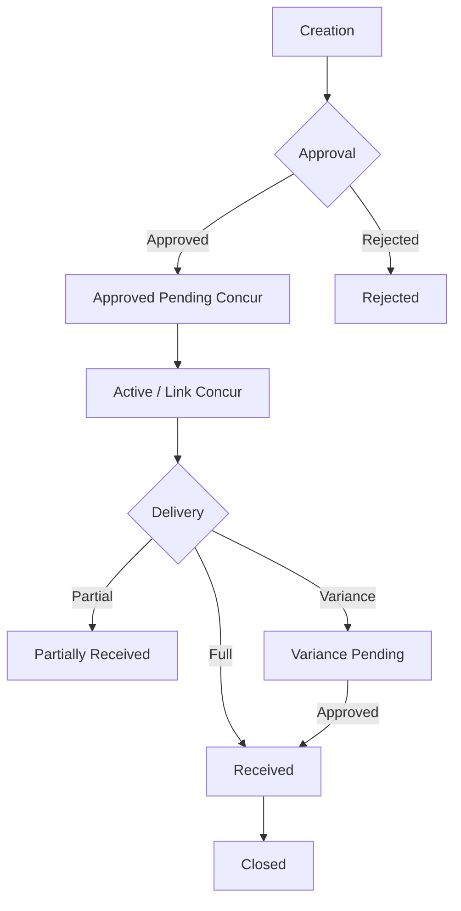

# Purchase Order Request Process Documentation

This document outlines the end-to-end Purchase Order (PO) request process within ProcureFlow, detailing the statuses, data fields, and transition logic.

## 1. Process Overview

The PO lifecycle follows a structured workflow from initial request through internal approval, financial linking, and physical receipt of goods.

### Lifecycle Diagram (High Level)

---

## 2. Selection Logic (Pre-requisites)

Before a PO can be created, the following entities must be correctly configured:

*   **Sites:** Requests must be associated with a specific Site (e.g., Sydney, Mackay). Site selection filters the visible POs and determines the delivery destination.
*   **Suppliers:** Only suppliers with a confirmed `mappingStatus: 'CONFIRMED'` in the `supplier_product_map` table can have items added to a PO.
*   **Items:** The item catalog displayed during creation is filtered by:
    1.  The selected Supplier.
    2.  Confirmed product mappings.
    3.  Available stock (Effective Stock = Snapshot Qty - Pending Demand).

---

## 3. PO Creation (Step 1)

When a user submits a PO request via `POCreate.tsx`, the following occurs:

| Field | Description | Source/Logic |
| :--- | :--- | :--- |
| `status` | Initial status: **PENDING_APPROVAL** | Default |
| `requestDate` | Date of submission | Current ISO Date |
| `requesterId` | User ID of the creator | `currentUser` |
| `totalAmount` | Sum of all line item prices | `qty * unitPrice` |
| `customerName` | Optional customer reference | User Input |
| `reasonForRequest` | Depletion, New Customer, or Other | User Input |
| `comments` | Internal notes | User Input |
| `lines` | Array of `POLineItem` | Selected from catalog |

---

## 4. Status Transition Matrix

| Current Status | Action | New Status | Performed By |
| :--- | :--- | :--- | :--- |
| `PENDING_APPROVAL` | Approve | `APPROVED_PENDING_CONCUR` | Users with `approve_requests` |
| `PENDING_APPROVAL` | Reject | `REJECTED` | Users with `approve_requests` |
| `APPROVED_PENDING_CONCUR` | Link Concur PO # | `ACTIVE` | Users with `link_concur` |
| `ACTIVE` / `PARTIALLY_RECEIVED` | Record Delivery (Partial) | `PARTIALLY_RECEIVED` | Users with `receive_goods` |
| `ACTIVE` / `PARTIALLY_RECEIVED` | Record Delivery (Full/Closed)| `RECEIVED` | Users with `receive_goods` |
| `ACTIVE` / `PARTIALLY_RECEIVED` | Over-delivery or Short-close | `VARIANCE_PENDING` | System Logic (`addDelivery`) |
| `VARIANCE_PENDING` | Approve Variance | `RECEIVED` | Users with `approve_requests` |

---

## 5. Field Updates by Stage

### Approval Stage
*   **Header:** `status` updated.
*   **History:** A new `ApprovalEvent` (action: `APPROVED` or `REJECTED`) is appended to `approvalHistory`.

### Concur Linking Stage
*   **Header:** `status` set to `ACTIVE`.
*   **Lines:** `concurPoNumber` is updated for **all** items in the request.

### Delivery Stage
*   **Header:** `status` updated based on receipt volume and variance logic.
*   **Lines:** `quantityReceived` is incremented. `isForceClosed` set to `true` if line was manually closed short.
*   **Deliveries (New):** A `DeliveryHeader` and associated `DeliveryLineItem` records are created in the database.

---

## 6. Unclear or Missing Aspects

Based on the current codebase review, the following areas require clarification or further implementation:

1.  **Transition to `CLOSED`:** The code defines a `CLOSED` status, but no explicit mechanism (button or automatic logic) was found in the PO detail view to move a PO from `RECEIVED` to `CLOSED`.
2.  **Variance Resolution Scope:** Currently, the system only allows "Approving" a variance (moving to `RECEIVED`). There is no explicit "Reject Variance" workflow to return goods or adjust the PO.
3.  **Automatic Concur Sync:** The workflow implies a manual "Link Concur PO" step. It is unclear if there is a planned secondary background process for automatic synchronization.
4.  **Financial Adjustment:** While `DeliveryLineItem` finance info (e.g., `is_capitalised`) can be updated, there is no logic to handle price discrepancies between the PO `unitPrice` and the final Invoice Price at the PO header level.
5.  **Role Mapping:** Permissions like `approve_requests` are checked, but the specific default mapping of these permissions to the `SITE_USER` and `ADMIN` roles is managed dynamically via the database (`getRoles`), making it important for admins to configure these correctly in the Settings UI.
