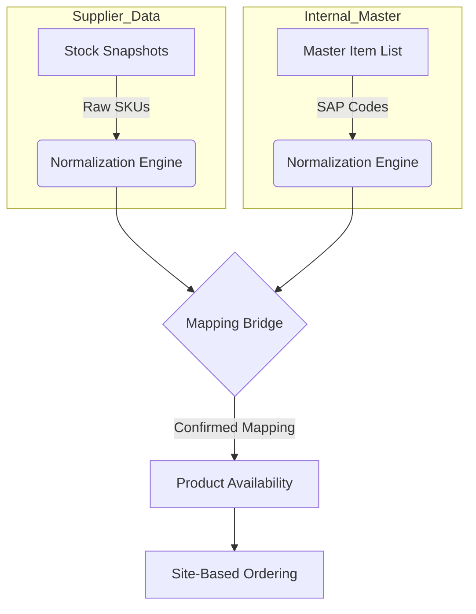

# ProcureFlow: Official Technical & Operational Ecosystem Overview

## 1. Executive Summary
ProcureFlow is an institutional-grade procurement management and inventory visibility platform. It bridges the gap between volatile supplier stock data and internal procurement workflows, ensuring that site-based staff order exactly what is available, at the correct price, and through a rigorous approval hierarchy. 

By automating the "Item Mapping" process and providing a real-time "Product Availability" engine, ProcureFlow eliminates the manual effort and data entry errors traditionally associated with large-scale industrial procurement.

---

## 2. Core Functional Principles
The application is built on three foundational pillars:

1. **Intelligent Mapping Bridge**: A robust logic layer that normalizes and matches supplier SKUs to internal SAP Master Items, creating a "Mapping Memory" that settles over time.
2. **Dynamic Availability Engine**: Real-time calculation of "Orderable Quantity" by reconciling supplier stock snapshots with pending demand (committed POs).
3. **Rigid Governance Lifecycle**: A non-bypassable workflow from creation to financial linking (Concur) and physical receipt, ensuring every dollar spent is traceable.

---

## 3. The Technical Stack
ProcureFlow leverages a modern, serverless-oriented architecture for maximum scalability and low operational overhead.

| Layer | Technology | Rationale |
| :--- | :--- | :--- |
| **Frontend** | React 19 + TypeScript | High-performance, type-safe UI component architecture. |
| **Build Tool** | Vite 6 | Rapid development cycles and optimized production bundling. |
| **Styling** | Vanilla CSS + Tailwind | Premium, high-density dashboard aesthetics. |
| **Database** | PostgreSQL (Supabase) | Relational integrity with modern JSONB support for specs. |
| **Auth/SSO** | Azure Entra ID (OIDC) | Seamless institutional login via Corporate Microsoft accounts. |
| **Backend/SDK** | Supabase JS | Real-time data synchronization and Row Level Security (RLS). |
| **Infrastructure** | Azure Web Apps (Linux) | Enterprise-grade hosting with CI/CD integration. |

---

## 4. Functional Ecosystem (The Mapping Bridge)
The "Connective Tissue" of ProcureFlow is the relationship between three data layers:

- **Stock Snapshots**: Fresh, volatile data uploaded via Excel.
- **Master Items**: Stable "Source of Truth" for internal cataloging.
- **Mapping Bridge**: Persists relationships (CONFIRMED/PROPOSED) so the system "learns" supplier catalogs.

---

## 5. User Experience (The Procurement Workflow)
The user experience is tailored to specific roles, ensuring a streamlined path from "Need" to "Receipt".

### 5.1 The PO Lifecycle
1. **Creation**: Users browse a site-filtered catalog. Logic prevents ordering unmapped items. 
2. **Approval**: Status → `PENDING_APPROVAL`. Notified approvers review via high-density dashboards.
3. **Concur Linking**: Status → `APPROVED_PENDING_CONCUR`. Financial teams link internal SAP/Concur records.
4. **Active/Delivery**: Status → `ACTIVE`. Goods can now be received.
5. **Receipting**: Users record physical delivery. System handles Partials, Full Receipts, and Variances.

### 5.2 Key UI Components
- **Item Wizard**: Intelligent intake and categorization of new products.
- **Stock Mapping Dashboard**: Administrative cockpit for managing product relationships.
- **Mobile PWA**: Responsive interface allowing for on-site delivery receipting via mobile devices.

---

## 6. Governance & Security Management
Security is not an overlay but a core component of the data model.

- **Identity Management**: SSO via Azure AD ensures only `@splservices.com.au` accounts can authenticate.
- **RBAC (Role-Based Access Control)**:
    - **SITE_USER**: Limited to ordering and receiving within assigned sites.
    - **ADMIN**: Global visibility, setting management, and mapping overrides.
- **Data Isolation**: Multi-site architecture isolates data visibility based on user site assignments (`users.site_ids`).
- **Row Level Security (RLS)**: Enforced at the database level to ensure no user can query records outside their authorized scope.
- **Audit Logging**: Every transition (Update, Insert, Delete) is captured in a comprehensive `system_audit_logs` table with "Before/After" payloads.

---

## 7. Operational Governance State
| Aspect | Current Status |
| :--- | :--- |
| **Data Integrity** | High. Normalization logic prevents SKU duplicates. |
| **Process Transparency** | Complete. Every PO has a full versioned `approvalHistory`. |
| **Audit Readiness** | Exceptional. All financial linkages and delivery signatures are persisted. |
| **Site Autonomy** | Managed. Site-level filtering ensures clean operational dashboards. |

---

## 8. Summary of Achievement
ProcureFlow transforms procurement from a manual, spreadsheet-heavy task into a controlled, automated, and highly visible digital process. It achieves:
- **100% Visibility**: From supplier stock levels to the physical warehouse shelf.
- **Zero Ambiguity**: Product mapping ensures the right item is ordered every time.
- **Institutional Scale**: Built to handle thousands of SKUs across multiple sites with sub-second performance.
