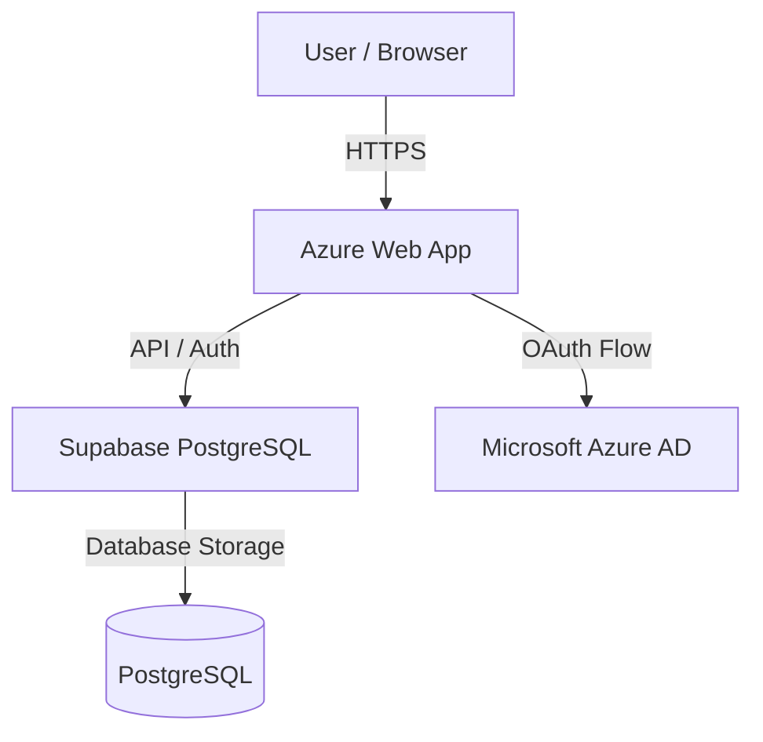
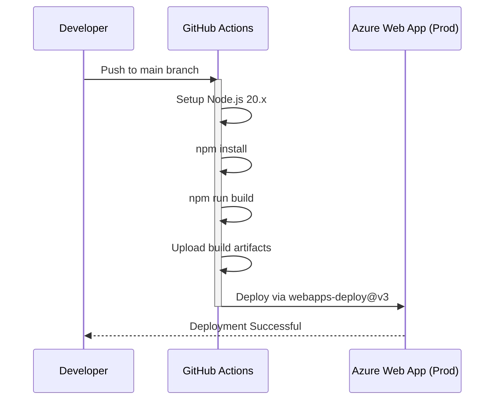
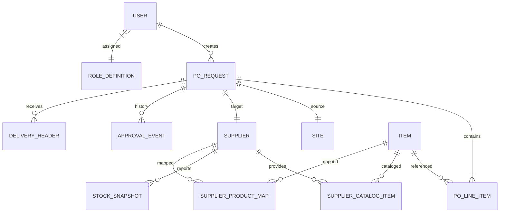

# ProcureFlow App

ProcureFlow is a professional procurement management system designed to streamline purchase requests, stock monitoring, and supplier management. It provides a robust workflow for item mapping, approval chains, and delivery tracking.

## Technology Stack

- **Frontend**: React 19, Vite 6, TailwindCSS (for styling)
- **Icons**: Lucide React
- **Charts**: Recharts
- **Database & Auth**: Supabase (PostgreSQL, Row Level Security)
- **Authentication**: Azure AD (Microsoft Office 365) via Supabase OAuth
- **Deployment**: Azure App Service (Linux)

---

## 🏗 Architecture

### High-Level Architecture


### Deployment Pipeline
The application uses GitHub Actions for continuous integration and deployment.


### Data Model
Inferred from the application's core types and Supabase schema.


---

## 🚀 Getting Started

### Prerequisites
- **Node.js**: 20.x or higher
- **npm**: 10.x or higher

### Environment Variables
Create a `.env` file in the root directory and provide the following variables:
```bash
VITE_SUPABASE_URL=your_supabase_project_url
VITE_SUPABASE_ANON_KEY=your_supabase_anon_key
```

### Installation
1. Clone the repository and navigate to the project folder.
2. Install dependencies:
   ```bash
   npm install
   ```

### Running Locally
To start the development server with staging settings:
```bash
npm run dev
```
To run against the production environment:
```bash
npm run dev:prod
```

### Building for Production
```bash
npm run build
```

---

## 🚢 Deployment Guide

The app is automatically deployed to **Azure App Service (Free Tier, Linux)** whenever changes are pushed to the `main` branch.

### Configuration
- **GitHub Secret**: `AZUREAPPSERVICE_PUBLISHPROFILE_...` must be set in the repository secrets.
- **Node Version**: 20.x is specified in the [workflow file](.github/workflows/main_procureflow-app-spl.yml).
- **Service Plan**: F1 (Free) Linux plan on Azure.

### Manual Deployment
You can manually trigger a deployment from the **Actions** tab in GitHub by selecting the "Build and deploy Node.js app" workflow and clicking "Run workflow".

---

## 🔑 Azure AD & Supabase Configuration

The error `Unsupported provider: provider is not enabled` usually means the Azure provider is not toggled "ON" in your Supabase Dashboard.

### Step 1: Azure App Registration
1. In the [Azure Portal](https://portal.azure.com/), go to **App registrations**.
2. Click **New registration** and name it "ProcureFlow".
3. Set **Supported account types** to "Accounts in this organizational directory only".
4. Add a **Redirect URI** (Platform: **Single-page application**):
   - Local: `http://localhost:3000` (or your local dev port)
   - Production: `https://your-project-ref.supabase.co/auth/v1/callback`
5. Note the **Application (client) ID**.
6. Note the **Directory (tenant) ID**.
7. Under **Certificates & secrets**, create a new **Client secret**.

### Step 2: Enable Azure in Supabase
1. Go to your [Supabase Dashboard](https://supabase.com/dashboard).
2. Navigate to **Authentication** -> **Providers**.
3. Find **Azure** in the list and expand it.
4. Toggle **Enable Azure** to "ON".
5. Fill in the following:
   - **Client ID**: Your Azure Application ID.
   - **Secret**: Your Azure Client Secret.
   - **Azure Tenant URL**: `https://login.microsoftonline.com/YOUR_TENANT_ID`
6. Click **Save**.


### Step 3: Site URL & Redirects
In **Authentication** -> **URL Configuration**:
- **Site URL**: `https://procureflow-app-spl.azurewebsites.net` (or your production URL).
- **Redirect URLs**: Add `http://localhost:3000/*` for local testing.

