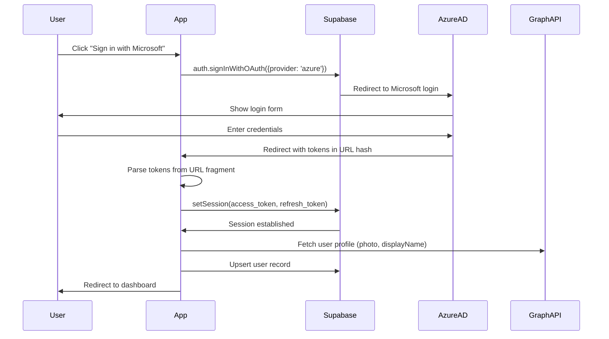

# ProcureFlow Application - Replication Blueprint

> **Purpose**: This document enables a new engineer to rebuild, deploy, and run the ProcureFlow application in a completely new environment without tribal knowledge. It captures the system exactly as it exists today.

---

## Table of Contents

1. [Executive Summary](#1-executive-summary)
2. [Technology Stack](#2-technology-stack)
3. [Repository Structure](#3-repository-structure)
4. [Database Schema](#4-database-schema)
5. [Authentication & Authorization](#5-authentication--authorization)
6. [Application Architecture](#6-application-architecture)
7. [PWA Configuration](#7-pwa-configuration)
8. [CI/CD Pipeline](#8-cicd-pipeline)
9. [Environment Variables & Secrets](#9-environment-variables--secrets)
10. [Deployment Steps](#10-deployment-steps)
11. [Post-Deployment Verification](#11-post-deployment-verification)
12. [Appendices](#12-appendices)

---

> [!WARNING]
> **CORRECTION NOTICE (2026-02-08)**: This document contains errors regarding the multi-site architecture. The `user_site_assignments` table referenced in this document **DOES NOT EXIST**. Multi-site isolation is actually implemented via a `site_ids` TEXT[] column on the `users` table. See `SYSTEM_ARCHITECTURE_COMPLETION.md` Section 5 for the correct implementation details.

---

## 1. Executive Summary

**ProcureFlow** is a procurement and inventory management Progressive Web Application (PWA) built for SPL Services. It manages purchase order workflows, supplier relationships, item catalogs, delivery tracking, and multi-site operations.

### Core Capabilities
- **Purchase Order Workflow**: Create, approve, and track purchase requests through configurable approval chains
- **Multi-Site Management**: Data isolation per site with user-site assignments
- **Supplier Integration**: Manage suppliers, catalog items, and auto-mapping between supplier SKUs and internal items
- **Delivery Tracking**: Record goods receipts against purchase orders
- **Finance Integration**: Link approved POs to Concur (external finance system)
- **PWA Features**: Offline capability, installable, push-ready architecture

### Key Integrations
| System | Purpose |
|--------|---------|
| **Supabase** | PostgreSQL database, authentication, real-time subscriptions |
| **Azure AD** | SSO via Microsoft OAuth (OIDC implicit flow) |
| **Azure Web Apps** | Production hosting |
| **GitHub Actions** | CI/CD automation |

---

## 2. Technology Stack

### Frontend
| Technology | Version | Purpose |
|------------|---------|---------|
| React | ^19.0.0 | UI framework |
| TypeScript | ^5.7.2 | Type safety |
| Vite | ^6.0.7 | Build tool & dev server |
| React Router DOM | ^7.1.3 | Client-side routing |
| Tailwind CSS | (via CDN) | Styling framework |
| Lucide React | ^0.474.0 | Icon library |
| Recharts | ^2.15.0 | Charting library |

### Backend/Database
| Technology | Purpose |
|------------|---------|
| Supabase | PostgreSQL database + Auth + Realtime |
| Row Level Security (RLS) | Data access control |

### Build & Deploy
| Technology | Purpose |
|------------|---------|
| GitHub Actions | CI/CD pipeline |
| Azure Web Apps | Production hosting |
| Node.js 20.x | Build runtime |

### Key Dependencies (from `package.json`)
```json
{
  "@supabase/supabase-js": "^2.49.1",
  "react": "^19.0.0",
  "react-dom": "^19.0.0",
  "react-router-dom": "^7.1.3",
  "lucide-react": "^0.474.0",
  "recharts": "^2.15.0",
  "uuid": "^11.0.5",
  "xlsx": "^0.18.5"
}
```

---

## 3. Repository Structure

```
ProcureFlow-App/
├── .github/
│   └── workflows/
│       └── main_procureflow-app-spl.yml    # GitHub Actions CI/CD
├── components/                              # React components (31 files)
│   ├── Layout.tsx                           # Main layout wrapper
│   ├── Login.tsx                            # Microsoft SSO login page
│   ├── Dashboard.tsx                        # Main dashboard
│   ├── POList.tsx                           # Purchase order list
│   ├── POCreate.tsx                         # Create new PO
│   ├── PODetail.tsx                         # PO detail view
│   ├── Settings.tsx                         # Admin settings panel
│   ├── FinanceView.tsx                      # Finance/Concur linking
│   ├── OnboardingWizard.tsx                 # Pending approval state
│   └── ...                                  # Other feature components
├── context/
│   └── AppContext.tsx                       # Global state & auth (1943 lines)
├── lib/
│   └── supabaseClient.ts                    # Supabase client initialization
├── services/
│   └── db.ts                                # Data access layer (1457 lines)
├── utils/
│   ├── normalization.ts                     # Item code normalization
│   ├── fileParser.ts                        # Excel/CSV parsing
│   ├── hierarchyManager.ts                  # Category hierarchy logic
│   └── ...                                  # Other utilities
├── public/
│   ├── manifest.json                        # PWA manifest
│   ├── sw.js                                # Service worker
│   └── icons/                               # PWA icons
├── supabase/
│   └── migrations/                          # Database migrations
├── App.tsx                                  # Root component & routing
├── main.tsx                                 # React entry point
├── index.html                               # HTML entry point
├── types.ts                                 # TypeScript interfaces (415 lines)
├── schema.sql                               # Database schema DDL (326 lines)
├── seed.sql                                 # Sample data for dev (113 lines)
├── vite.config.ts                           # Vite build configuration
├── tsconfig.json                            # TypeScript configuration
└── package.json                             # Dependencies & scripts
```

---

## 4. Database Schema

### Overview
The database is hosted on **Supabase** (PostgreSQL). Full schema defined in `schema.sql`.

### Core Tables

| Table | Purpose | Key Fields |
|-------|---------|------------|
| `users` | User accounts | id, email, name, role_id, azure_oid, status |
| `roles` | Permission roles | id (PK string), name, permissions[], is_system |
| `sites` | Business locations | id, name, suburb, state, address |
| ~~`user_site_assignments`~~ | ~~DOES NOT EXIST~~ | See `users.site_ids` TEXT[] |
| `suppliers` | Vendor records | id, name, contact_email, categories[] |
| `items` | Master product catalog | id, sku, name, category, unit_price, active_flag |
| `po_requests` | Purchase orders | id, display_id, requester_id, site_id, supplier_id, status |
| `po_lines` | PO line items | id, po_request_id, item_id, quantity_ordered, unit_price |
| `po_approvals` | Approval history | id, po_request_id, approver_id, action, date |
| `deliveries` | Goods receipts | id, po_request_id, docket_number, received_by |
| `delivery_lines` | Delivery line items | id, delivery_id, po_line_id, quantity |
| `workflow_steps` | Approval rules | id, step_name, approver_role, condition_type, order |
| `stock_snapshots` | Supplier stock data | id, supplier_id, supplier_sku, sell_price, snapshot_date |
| `supplier_product_map` | SKU mapping | supplier_id, product_id, supplier_sku, mapping_status |

### Key Relationships
```
users.role_id → roles.id
users.site_ids → sites (not FK, app-level validation)
po_requests.requester_id → users.id
po_requests.site_id → sites.id
po_requests.supplier_id → suppliers.id
po_lines.po_request_id → po_requests.id
po_lines.item_id → items.id
po_approvals.po_request_id → po_requests.id
deliveries.po_request_id → po_requests.id
delivery_lines.delivery_id → deliveries.id
```

### Row Level Security (RLS)
RLS is enabled on all tables. Current policy uses service role key (anon key allows authenticated access), with application-level filtering in `AppContext.tsx` based on `activeSiteIds`.

### Required Extensions
```sql
CREATE EXTENSION IF NOT EXISTS "uuid-ossp";
```

### Item Code Normalization
The system normalizes item codes for matching (see `utils/normalization.ts`):
1. Trim whitespace
2. Convert to uppercase
3. Remove spaces, hyphens, underscores
4. Generate alternate form (strip leading 'R' if applicable)

Items table uses `sap_item_code_norm` for normalized matching.

---

## 5. Authentication & Authorization

### Authentication Flow



### Supabase Client Configuration (`lib/supabaseClient.ts`)
```typescript
export const supabase = createClient(
  import.meta.env.VITE_SUPABASE_URL,
  import.meta.env.VITE_SUPABASE_ANON_KEY,
  {
    auth: {
      flowType: 'implicit',        // Required for Azure AD OIDC
      autoRefreshToken: true,
      persistSession: true,
      detectSessionInUrl: true
    }
  }
);
```

### Azure AD Provider Configuration (in Supabase Dashboard)
- **Provider**: Azure (Microsoft)
- **Flow**: Implicit (OIDC)
- **Scopes**: `openid profile email User.Read`
- **Redirect URL**: `https://<supabase-project>.supabase.co/auth/v1/callback`

### Domain Restriction
The application restricts access to `@splservices.com.au` emails:
```typescript
// In login function (AppContext.tsx)
const DOMAIN_ALLOW = '@splservices.com.au';
if (!session.user.email?.endsWith(DOMAIN_ALLOW)) {
  await supabase.auth.signOut();
  setDomainError(`Only ${DOMAIN_ALLOW} accounts are permitted.`);
  return;
}
```

### User Status Flow
| Status | Meaning |
|--------|---------|
| `pending` | User logged in but awaiting admin approval |
| `approved` | User approved, full access granted |
| `disabled` | User access revoked |

### Role-Based Permissions
Roles defined in `roles` table with permissions array:
```sql
-- Example from seed.sql
('SITE_USER', 'Site User', ARRAY['view_dashboard', 'create_request', 'receive_goods'])
('APPROVER', 'Approver', ARRAY['view_dashboard', 'view_all_requests', 'approve_requests'])
('ADMIN', 'Administrator', ARRAY['view_dashboard', 'create_request', 'view_all_requests', 
  'approve_requests', 'link_concur', 'receive_goods', 'view_finance', 
  'manage_finance', 'manage_settings', 'manage_items', 'manage_suppliers'])
```

### Session Persistence
- Sessions stored in `localStorage`
- Auto-refresh tokens enabled
- Token recovery from URL hash on redirect

---

## 6. Application Architecture

### Entry Point (`App.tsx`)
```
AppProvider (Context)
  └── BrowserRouter
        └── Routes
              ├── /login → Login
              ├── /pending-approval → OnboardingWizard
              └── / → RequireAuth → Layout
                    ├── index → Dashboard
                    ├── requests → POList
                    ├── create → POCreate
                    ├── requests/:id → PODetail
                    ├── finance → FinanceView
                    ├── settings → Settings
                    └── ... (other routes)
```

### State Management (`AppContext.tsx`)
Central context provides:
- **Authentication State**: `user`, `isAuthenticated`, `isLoadingAuth`, `isPendingApproval`
- **Data State**: `sites`, `users`, `suppliers`, `items`, `purchaseOrders`, `workflowSteps`
- **UI State**: `theme`, `branding`, `activeSiteIds`
- **Actions**: `login()`, `logout()`, `refreshUsers()`, `refreshItems()`, etc.

### Data Flow
1. **Initial Load**: `AppContext` checks session, fetches user data
2. **Site Selection**: User selects sites, stored in `localStorage` as `activeSiteIds`
3. **Data Filtering**: All data queries filter by `activeSiteIds`
4. **Mutations**: Via `db.ts` functions → Supabase → Optimistic UI updates

### Lazy Loading
Heavy components are lazy-loaded for performance:
```typescript
const Dashboard = lazy(() => import('./components/Dashboard'));
const POList = lazy(() => import('./components/POList'));
// ... etc
```

### Service Worker Registration (`App.tsx`)
```typescript
if ('serviceWorker' in navigator) {
  window.addEventListener('load', () => {
    navigator.serviceWorker.register('/sw.js');
  });
}
```

---

## 7. PWA Configuration

### Manifest (`public/manifest.json`)
```json
{
  "name": "ProcureFlow",
  "short_name": "ProcureFlow",
  "description": "Procurement Management System",
  "start_url": "/",
  "display": "standalone",
  "theme_color": "#1e293b",
  "background_color": "#0f172a",
  "icons": [
    { "src": "/icons/icon-192x192.png", "sizes": "192x192", "type": "image/png" },
    { "src": "/icons/icon-512x512.png", "sizes": "512x512", "type": "image/png" },
    { "src": "/icons/icon-maskable-512x512.png", "sizes": "512x512", "type": "image/png", "purpose": "maskable" }
  ],
  "shortcuts": [
    { "name": "New Request", "url": "/create", "icons": [...] },
    { "name": "Approvals", "url": "/approvals", "icons": [...] }
  ]
}
```

### Service Worker (`public/sw.js`)

**Caching Strategies:**
| Request Type | Strategy | Fallback |
|--------------|----------|----------|
| HTML, API, Supabase | Network-first | Cache |
| Static assets (JS, CSS, images) | Cache-first | Network |
| Other | Network-only | None |

**Version Management:**
- Fetches `/version.json` on activation
- Cache names prefixed with version: `ProcureFlow-{timestamp}`
- Old caches deleted on new version

**Build-time Version Generation (`vite.config.ts`):**
```typescript
const versionGenerator = () => ({
  name: 'version-generator',
  buildStart() {
    const versionData = {
      version: Date.now().toString(),
      buildTime: new Date().toISOString(),
      gitHash: execSync('git rev-parse --short HEAD').toString().trim(),
      environment: process.env.NODE_ENV
    };
    fs.writeFileSync('public/version.json', JSON.stringify(versionData, null, 2));
  }
});
```

### Required Icons
Generate icons in these sizes:
- 72x72, 96x96, 128x128, 144x144, 152x152, 192x192, 384x384, 512x512
- Maskable versions for Android adaptive icons

---

## 8. CI/CD Pipeline

### GitHub Actions Workflow (`.github/workflows/main_procureflow-app-spl.yml`)

```yaml
name: Build and deploy to Azure Web App

on:
  push:
    branches: [main]
  workflow_dispatch:

jobs:
  build:
    runs-on: ubuntu-latest
    steps:
      - uses: actions/checkout@v4
      - uses: actions/setup-node@v4
        with:
          node-version: '20.x'
          cache: 'npm'
      
      - name: npm install, build, and test
        run: |
          npm install
          npm run build --if-present
          npm run test --if-present
        env:
          VITE_SUPABASE_URL: ${{ secrets.VITE_SUPABASE_URL }}
          VITE_SUPABASE_ANON_KEY: ${{ secrets.VITE_SUPABASE_ANON_KEY }}
      
      - uses: actions/upload-artifact@v4
        with:
          name: node-app
          path: .

  deploy:
    runs-on: ubuntu-latest
    needs: build
    steps:
      - uses: actions/download-artifact@v4
        with:
          name: node-app
      
      - uses: azure/webapps-deploy@v3
        with:
          app-name: 'ProcureFlow-App-SPL'
          slot-name: 'Production'
          package: .
          publish-profile: ${{ secrets.AZUREAPPSERVICE_PUBLISHPROFILE_... }}
```

### Build Process
1. Checkout code
2. Setup Node.js 20.x
3. `npm install` - Install dependencies
4. `npm run build` - Runs `tsc && vite build --mode production`
5. Upload artifact (entire directory)
6. Deploy to Azure Web App

---

## 9. Environment Variables & Secrets

### Build-time Variables (injected via GitHub Secrets)
| Variable | Purpose | Example |
|----------|---------|---------|
| `VITE_SUPABASE_URL` | Supabase project URL | `https://xxxxx.supabase.co` |
| `VITE_SUPABASE_ANON_KEY` | Supabase anonymous/public key | `eyJhbGciOiJIUzI1NiIs...` |

### Deployment Secrets
| Secret | Purpose |
|--------|---------|
| `AZUREAPPSERVICE_PUBLISHPROFILE_*` | Azure Web App publish profile for deployment |

### Where to Configure

**GitHub Secrets:**
1. Go to repository → Settings → Secrets and variables → Actions
2. Add repository secrets for each variable

**Supabase Dashboard:**
1. Project Settings → API → URL and anon/public key
2. Authentication → Providers → Azure → Configure client ID/secret

**Azure AD App Registration:**
1. Azure Portal → Entra ID → App registrations
2. Configure redirect URIs, API permissions (User.Read)

---

## 10. Deployment Steps

### Prerequisites
- [ ] GitHub repository access
- [ ] Azure subscription with Web App created
- [ ] Supabase project created
- [ ] Azure AD app registration configured

### Step 1: Supabase Setup

1. **Create Project**
   - Go to supabase.com → New Project
   - Note the project URL and anon key

2. **Run Schema**
   ```bash
   # In Supabase SQL Editor, execute:
   schema.sql
   ```

3. **Seed Data (Optional)**
   ```bash
   # In Supabase SQL Editor, execute:
   seed.sql
   ```

4. **Configure Azure Provider**
   - Authentication → Providers → Azure
   - Add Azure AD client ID and secret
   - Set redirect URL in Azure AD app

### Step 2: Azure AD Configuration

1. **Create App Registration**
   - Azure Portal → Entra ID → App registrations → New
   - Name: `ProcureFlow`
   - Redirect URI: `https://<supabase-project>.supabase.co/auth/v1/callback`

2. **API Permissions**
   - Microsoft Graph → Delegated → `User.Read`, `openid`, `profile`, `email`

3. **Client Secret**
   - Certificates & secrets → New client secret
   - Copy value to Supabase Azure provider config

### Step 3: GitHub Secrets

Add these secrets in repository settings:
```
VITE_SUPABASE_URL=https://xxxxx.supabase.co
VITE_SUPABASE_ANON_KEY=eyJhbGciOiJIUzI1NiIs...
AZUREAPPSERVICE_PUBLISHPROFILE_*=(download from Azure Web App)
```

### Step 4: Azure Web App

1. **Create Web App**
   - Azure Portal → App Services → Create
   - Runtime: Node 20 LTS
   - OS: Linux (recommended)

2. **Download Publish Profile**
   - Web App → Overview → Get publish profile
   - Add as GitHub secret

3. **Configure Startup Command (if needed)**
   ```bash
   npx serve -s dist --listen 8080
   ```
   Or use `pm2 serve /home/site/wwwroot/dist --no-daemon --spa`

### Step 5: Deploy

1. Push to `main` branch
2. GitHub Actions will build and deploy automatically
3. Monitor Actions tab for deployment status

---

## 11. Post-Deployment Verification

### Functional Checks

| Check | How to Verify |
|-------|---------------|
| App loads | Navigate to app URL, see login page |
| Microsoft login works | Click "Sign in with Microsoft", complete flow |
| User created in DB | Check `users` table in Supabase |
| Dashboard loads | After login, dashboard appears with no errors |
| Data queries work | Sites/suppliers/items load in settings |
| PWA installable | Chrome shows install prompt |
| Service worker registered | DevTools → Application → Service Workers |

### Console Verification
Open browser DevTools, check for:
- No red errors in Console
- `SW: Service Worker registered successfully` message
- `Auth: Session established` message
- Network requests to Supabase returning 200s

### Database Verification
```sql
-- Check users exist
SELECT id, email, status, role_id FROM users;

-- Check roles exist
SELECT * FROM roles;

-- Check sites exist  
SELECT * FROM sites;
```

---

## 12. Appendices

### A. NPM Scripts

| Script | Command | Purpose |
|--------|---------|---------|
| `dev` | `vite` | Start dev server |
| `build` | `npm run build:prod` | Production build |
| `build:prod` | `tsc && vite build --mode production` | Full production build |
| `build:staging` | `tsc && vite build --mode staging` | Staging build |
| `preview` | `vite preview` | Preview production build |

### B. Vite Configuration Highlights

```typescript
// vite.config.ts key settings
export default defineConfig({
  plugins: [react(), versionGenerator()],
  define: {
    'import.meta.env.VITE_SUPABASE_URL': JSON.stringify(process.env.VITE_SUPABASE_URL),
    'import.meta.env.VITE_SUPABASE_ANON_KEY': JSON.stringify(process.env.VITE_SUPABASE_ANON_KEY)
  },
  resolve: {
    alias: {
      '@': path.resolve(__dirname, './'),
      '@components': path.resolve(__dirname, './components'),
      '@services': path.resolve(__dirname, './services')
    }
  },
  build: {
    rollupOptions: {
      output: {
        manualChunks: {
          vendor: ['react', 'react-dom', 'react-router-dom'],
          ui: ['lucide-react', 'recharts'],
          db: ['@supabase/supabase-js']
        }
      }
    }
  }
});
```

### C. TypeScript Configuration

```json
// tsconfig.json
{
  "compilerOptions": {
    "target": "ES2022",
    "module": "ESNext",
    "moduleResolution": "bundler",
    "jsx": "react-jsx",
    "strict": true,
    "paths": {
      "@/*": ["./*"],
      "@components/*": ["./components/*"],
      "@services/*": ["./services/*"]
    }
  }
}
```

### D. PO Status Workflow

```
DRAFT → PENDING → APPROVED → APPROVED_PENDING_CONCUR → ACTIVE → COMPLETED
                ↘ REJECTED
```

| Status | Meaning |
|--------|---------|
| `DRAFT` | Saved but not submitted |
| `PENDING` | Awaiting approval |
| `APPROVED` | Approved, awaiting Concur link |
| `APPROVED_PENDING_CONCUR` | Approved, Concur PO number pending |
| `ACTIVE` | Concur linked, ready for delivery |
| `COMPLETED` | All items delivered |
| `REJECTED` | Approval denied |

### E. Mapping Engine

The auto-mapping system (`db.runAutoMapping`) matches supplier SKUs to internal items:

**Scoring Components:**
| Type | Max Score | Criteria |
|------|-----------|----------|
| ID_MATCH_NORM | 1.0 | Exact normalized code match |
| ID_MATCH_SKU | 1.0 | Exact SKU match |
| ID_MATCH_ALT | 0.9 | Alternate code match |
| TEXT_SIMILARITY | 0.5 | Jaccard similarity on names |
| ATTR_CATEGORY | 0.2 | Category match |
| FINANCE_PROXIMITY | 0.1 | Price within 10% |
| GLOBAL_CONSENSUS | 0.5 | Confirmed by other suppliers |

**Thresholds:**
- Score ≥ 1.2 → `CONFIRMED` (auto-approved)
- Score > 0.4 → `PROPOSED` (needs review)

### F. Multi-Site Data Isolation

1. Users assigned to sites via `users.site_ids` TEXT[] column (NOT a join table)
2. Active sites stored in `localStorage` as `activeSiteIds`
3. All data queries filter by site: `po_requests.site_id IN (activeSiteIds)` (app-level only)
4. Dashboard/reports only show data for active sites
5. **SECURITY NOTE**: Filtering is application-level only; RLS policies are permissive

### G. Troubleshooting

| Issue | Cause | Solution |
|-------|-------|----------|
| White screen after login | Token parsing failure | Check URL callback, clear localStorage |
| "Only @splservices.com.au..." | Domain restriction | Use correct email domain |
| 401 on API calls | Session expired | Refresh page, re-login |
| PWA not updating | Cached old version | Clear caches via DevTools |
| Service worker not found | Wrong path | Ensure `sw.js` in public folder |

---

## Document Metadata

| Field | Value |
|-------|-------|
| **Version** | 1.0 |
| **Created** | 2026-02-07 |
| **Repository** | `ProcureFlow-App` |
| **Primary Stack** | React + Supabase + Azure |
| **Target Environment** | Azure Web Apps |

---

> **Note**: This document captures the system as it exists. For architectural explanations and design rationale, see `SYSTEM_ARCHITECTURE_COMPLETION.md`.
