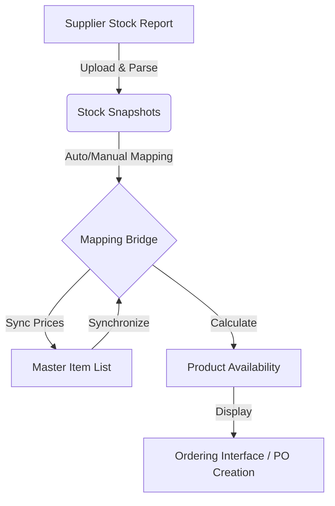

# Logic Blueprint: Stock, Mapping, and the Master Item List

This document provides a comprehensive blueprint of how Stock reports, Product Mapping, and the Master Item List function together within ProcureFlow. It covers the data structures, high-level logic, and the bridge that connects supplier data to internal products.

---

## 1. System Architecture Overview

The system operates in three distinct layers, with the **Mapping Bridge** serving as the connective tissue between volatile supplier data and stable internal master data.

---

## 2. Component Breakdowns

### 2.1 The Master Item List (Product Master)
The Master Item List is the "Source of Truth" for all products known to the organization.
- **Table**: `items`
- **Key Identifiers**:
    - `id`: Internal UUID.
    - `sku`: Internal code (often matching SAP SAP_Item_Code).
    - `sap_item_code_norm`: A normalized version of the SKU used for high-confidence matching.
- **Role**: Defines hierarchies (Category, Sub-Category, Range), default pricing, and unit of measure (UOM).

### 2.2 Stock Snapshots (Supplier Raw Data)
Stock snapshots represent a point-in-time view of what a supplier has in their warehouse.
- **Table**: `stock_snapshots`
- **Key Identifiers**:
    - `supplier_sku`: The supplier's specific internal code.
    - `customer_stock_code_norm`: The normalized version of the code the supplier uses to identify the product for the customer.
- **Logic**:
    - **Intelligent Intake**: Uses an enhanced file parser to detect date columns (for incoming stock) and map dynamic headers.
    - **Normalization**: Every uploaded SKU is normalized (case-insensitive, alphanumeric only) to facilitate matching.

### 2.3 The Mapping Bridge (Bridge)
The mapping bridge defines the relationship between a Supplier's SKU and an Internal Master Item.
- **Table**: `supplier_product_map`
- **Logic**:
    - **Auto-Mapping**: Triggered immediately after a stock upload. It compares normalized codes between snapshots and master items.
    - **Mapping Persistence**: once a mapping is "CONFIRMED" (either manually or by high-confidence auto-logic), it is stored as a persistent entry in the **Mapping Memory**.
    - **Attributes**:
        - `mapping_status`: `PROPOSED` (needs review), `CONFIRMED` (trusted), or `REJECTED`.
        - `mapping_method`: Records how the match was found (e.g., `AUTO_NORM`, `AUTO_SKU_EXACT`, `MANUAL`).
        - `confidence_score`: 1.0 for manual/exact matches, lower for fuzzy matches.

### 2.4 Mapping Memory Manager
Administrators can manage confirmed mappings globally across all suppliers.
- **Functionality**:
    - **Memory View**: A unified list of all confirmed mappings with joined supplier and item data.
    - **Mapping Removal**: Forgetting a mapping decision so future uploads require re-mapping.
    - **Intelligent Item Sync**: A bulk operation that updates Master Item `unitPrice` fields based on the latest confirmed supplier sell prices from stock snapshots.

---

## 3. Core Process Flows

### 3.1 Stock Refresh Flow
1.  **Upload**: User uploads an Excel file in `Settings > Mapping`.
2.  **Verify**: User confirms column mappings (Excel Headers -> System Fields).
3.  **Normalization**: System populates `customer_stock_code_norm` for all new snapshots.
4.  **Auto-Match**: System runs `runAutoMapping()`:
    -   **Level 1 (Direct)**: Matches Normalized Supplier Code to Normalized Internal SKU.
    -   **Level 2 (Alternate)**: Matches using "Right-Strip" logic (removing suffix characters like `-R`).
    -   **Level 3 (Fuzzy)**: Token-based name comparison with RFID/Non-RFID safeguarding.
5.  **Intelligent Sync (Optional/Auto)**: System triggers `syncItemsFromSnapshots()` to update master item prices from the fresh snapshot data.
6.  **Update Availability**: System triggers `refreshAvailability()` to join the new snapshots with confirmed mappings and refresh app-wide stock levels.

### 3.2 Ordering Logic (The "End Result")
When a user goes to create a Purchase Order, the system calculates `availableOrderQty` as follows:

$$ \text{Available Order Qty} = \lfloor (\text{Snapshot Available Qty} \times \text{Conversion Factor}) / \text{Order Multiple} \rfloor \times \text{Order Multiple} $$

- **Snapshot Available Qty**: From the latest `stock_snapshots`.
- **Conversion Factor**: From `supplier_product_map`.
- **Order Multiple**: From `items` (e.g., must order in multiples of 5).

---

## 4. Logical Interaction Matrix

| Feature | Stock Snapshots | Mapping Bridge | Master Item List |
| :--- | :--- | :--- | :--- |
| **Primary Key** | `id` (UUID) | `id` (UUID) | `id` (UUID) |
| **Data Source** | External (Reports) | Internal (Logic/User) | Internal (Static) |
| **Volatility** | High (Updates Daily) | Low (Stable once set) | Low (Managed by Admin) |
| **Normalization** | Required for Match | Mediates Match | Required for Match |
| **Visibility** | Admin Only | Admin Only | Everyone |

---

## 5. Summary of Integration
1.  **Intake**: Stock snapshots accept any data from suppliers.
2.  **Association**: The Mapping Bridge interprets that data by linking it to the Master Item List.
3.  **Hierarchy**: The Master Item List organizes the mapped data into a browsable hierarchy for users.
4.  **Action**: The three combined allow for precise, automated stock management and ordering.
