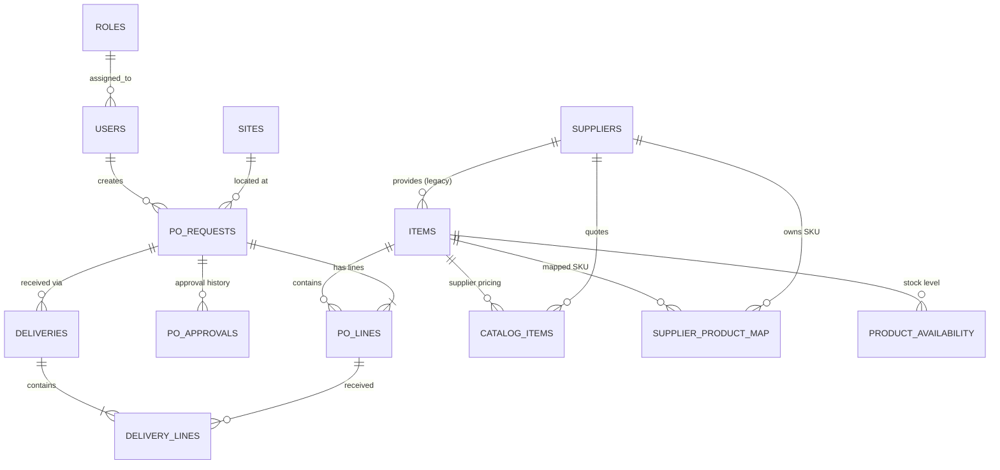

# WebApp Plug-and-Play Blueprint: ProcureFlow-App

## 1. Engineering Context Capsule
- **App Name**: ProcureFlow-App
- **Purpose**: Procurement and Inventory management system for multi-site operations. [Observed: [README.md](file:///c:/Github/ProcureFlow-App/README.md)]
- **Core Architecture**: SPA (React) + BaaS (Supabase) + Hosting (Azure). [Observed: [package.json](file:///c:/Github/ProcureFlow-App/package.json), [services/db.ts](file:///c:/Github/ProcureFlow-App/services/db.ts), `.github/workflows`]
- **Primary Stakeholders**: Procurement Officers, Site Managers, Finance [Inferred: component names like `FinanceView`, `ActiveRequestsView`]

## 2. Repo Baseline Inventory
- **Stack**: React 19, Vite 6, TypeScript 5.8
- **Package Manager**: npm (v10+ inferred)
- **Directory Map**:
  - `/components`: Logic-heavy UI components
  - `/services`: Supabase/DB interface layer (`db.ts`)
  - `/context`: Global state management (`AppContext.tsx`)
  - `/lib`: Third-party library initializations (`supabaseClient.ts`)
  - `/utils`: Helper functions (normalization, date formatting)
  - `/supabase`: SQL migrations and schema definitions
  - `/scripts`: Administrative and data-sync scripts
- **Entry Points**:
  - `index.html`: Root template
  - `index.tsx`: Application entry
  - `App.tsx`: Routing and higher-level layout logic

## 3. Stack Bill of Materials
| Category | Technology | File Path | Purpose |
|----------|------------|-----------|---------|
| **Frontend** | React 19 | `App.tsx` | UI Framework |
| **Bundler** | Vite 6 | `vite.config.ts` | Build Tooling |
| **Language** | TypeScript | `tsconfig.json` | Type Safety |
| **Auth/DB** | Supabase | `lib/supabaseClient.ts` | Backend-as-a-Service |
| **Routing** | React Router 7 | `package.json` | SPA Navigation |
| **State** | React Context | `context/AppContext.tsx` | Global Store |
| **Styling** | Vanilla CSS | `index.css` | Design Token System |
| **Icons** | Lucide React | `package.json` | Visual Identity |
| **Charts** | Recharts | `package.json` | Data Visualization |
| **Excel** | SheetJS (xlsx) | `package.json` | Data Import/Export |
| **Hosting** | Azure Web App | `.github/workflows/...` | Production Hosting |

## 4. Configuration Contract

### Env Vars (.env / GH Secrets)
| Key | Reference | Required | Purpose |
|-----|-----------|----------|---------|
| `VITE_SUPABASE_URL` | `supabaseClient.ts` | Yes | Supabase endpoint |
| `VITE_SUPABASE_ANON_KEY` | `supabaseClient.ts` | Yes | Client-side API key |
| `GEMINI_API_KEY` | `vite.config.ts` | No | AI mapping logic [Inferred] |

### Config Files
- `vite.config.ts`: Defines manual code splitting (vendor, ui, db) and injections.
- `tsconfig.json`: Standard React/TS config.

## 5. Phase A — Frontend Architecture

### 5.1 Routing Architecture
The application uses `react-router-dom` (v7/v6 style) with a central route tree in `App.tsx`.

| Path | Component | Protection | Layout |
| :--- | :--- | :--- | :--- |
| `/login` | `Login` | Public | No |
| `/pending-approval` | `OnboardingWizard` | Auth (isPendingApproval) | No |
| `/` | `Dashboard` | Auth (RequireAuth) | Yes |
| `/requests` | `POList (filter="ALL")` | Auth (RequireAuth) | Yes |
| `/approvals` | `POList (filter="PENDING")` | Auth (RequireAuth) | Yes |
| `/active-requests` | `ActiveRequestsView` | Auth (RequireAuth) | Yes |
| `/requests/:id` | `PODetail` | Auth (RequireAuth) | Yes |
| `/create` | `POCreate` | Auth (RequireAuth) | Yes |
| `/finance` | `FinanceView` | Auth (RequireAuth) | Yes |
| `/settings` | `Settings` | Auth (RequireAuth) | Yes |
| `/reports` | `ReportingView` | Auth (RequireAuth) | Yes |
| `/history` | `HistoryView` | Auth (RequireAuth) | Yes |
| `/help` | `HelpGuide` | Auth (RequireAuth) | Yes |

- **RequireAuth Guard**:
  - `isLoadingAuth`: Shows full-screen spinner.
  - `!isAuthenticated`: Redirects to `/login`.
  - `isPendingApproval`: Redirects to `/pending-approval`.

### 5.2 Component Architecture
Components are organized functionally in the root `components/` directory.

- **Layout Shell (`Layout.tsx`)**:
  - Contains Sidebar, Mobile Header, and `Outlet` for child routes.
  - Handles dynamic theme switching (Light/Dark/Brand).
  - Implements dynamic menu generation based on `branding.menuConfig`.
- **Feature Groups**:
  - **Procurement**: `POCreate`, `PODetail`, `POList`, `DeliveryModal`.
  - **Admin/Mapping**: `AdminMigration`, `CatalogManagement`, `AdminAccessHub`, `StockMappingConfirmation`, `MenuEditor`.
  - **Audit/Reporting**: `AuditLogViewer`, `ReportingView`, `HistoryView`.
- **Shared/UI Components**:
  - `MultiSiteSelector`, `ItemWizard`, `ConfirmDialog`, `ToastNotification`, `VersionBadge`.

### 5.3 State Management Model
- **Primary Provider (`AppContext.tsx`)**:
  - **Auth State**: Manages `currentUser`, `isAuthenticated`, and manual token recovery logic.
  - **Global Master Data**: Fetches and caches `items`, `sites`, `suppliers`, `roles`, `categories` via `reloadData`.
  - **Procurement State**: Manages `requests`, `deliveries`, `stockSnapshots`.
  - **UI State**: Manages `theme`, `branding`, `activeSiteIds` (persisted in `localStorage`).
- **Data Fetching Patterns**:
  - **Hydration**: `AppProvider` calls `initializeAuth` and `reloadData` on mount.
  - **Smart Sync**: `reloadData` uses a `smart_sync` check (Supabase timestamp or version hash) to avoid redundant full-fetches.
  - **Resilience**: `safeFetch` wrapper provides centralized error handling and fallback logic.

### 5.4 UI-to-DB Interaction patterns
- **Service Layer (`services/db.ts`)**: Pure async functions returning typed Promises.
- **Pattern**:
  1. Component calls `useApp()` to access context methods (e.g., `createPO`).
  2. Context method calls `db.ts` function.
  3. Context updates local state and provides feedback via Toast or return values.
- **Example (Update PO)**:
```typescript
// AppContext.tsx
const updatePOStatus = async (poId, status, event) => {
  setIsLoading(true);
  try {
    await db.updatePOStatus(poId, status, event);
    await reloadData(); // Refresh global lists
  } finally {
    setIsLoading(false);
  }
}
```

## 6. Phase B — Database & API Contract

### 6.1 Relational Schema (ERD)


### 6.2 Table Contract & Access Mapping
| Table Name | Primary Keys | FKs | Key Queries |
| :--- | :--- | :--- | :--- |
| `users` | `id (UUID)` | `role_id -> roles` | `select *`, `update status` |
| `po_requests` | `id (UUID)` | `requester_id, site_id, supplier_id` | `select joined with user/site/supplier` |
| `po_lines` | `id (UUID)` | `po_id, item_id` | `select by po_id` |
| `items` | `id (UUID)` | `supplier_id` | `select *`, `upsert with unique sku` |
| `supplier_product_map`| `id` | `supplier_id, product_id` | `select matching supplier_sku` |

### 6.3 Security Contract (RLS Policies)
- **Hardened User Access**:
  - `CREATE POLICY "Users can view their own profile" ON users FOR SELECT USING (auth.uid() = id);`
  - `CREATE POLICY "Admins can view and edit all users" ON users FOR ALL USING (EXISTS (SELECT 1 FROM users WHERE id = auth.uid() AND role_id = 'ADMIN'));`
- **Permissive Defaults (Internal Data)**:
  - `roles`, `sites`, `suppliers`, `items`, `workflow_steps`, `notification_settings` all currently default to **"Allow all public access"** (Policy: `true`).
  - *Note for Rebuild*: These should be hardened to `role_id = 'ADMIN'` for mutations in a public environment.

### 6.4 Critical Constraints & Indexes
- **Unique Keys**:
  - `users.email` (UNIQUE)
  - `items.sku` (UNIQUE)
  - `supplier_product_map(supplier_id, product_id, supplier_sku)` (UNIQUE)
- **Performance Indexes**:
  - `idx_stock_snapshots_norm` on `customer_stock_code_norm`.
  - `idx_items_sap_norm` on `sap_item_code_norm`.

## 7. Phase C — Module Blueprints (Extraction Grade)

### 7.1 Auth & Identity (SSO + Merging)
- **Core Files**: `lib/supabaseClient.ts`, `context/AppContext.tsx` (`handleUserAuth`), `users` table.
- **Logic**: 
  - Domain lock (`@splservices.com.au`).
  - MS Graph Sync: Fetches `jobTitle` & `department` using `provider_token`.
  - **Placeholder Merging**: Critical for pre-provisioned users. If a user is invited by email, the first login with SSO updates the placeholder `id` to the real `auth.uid`.
- **Replication Recipe**: 
  1. Configure Supabase Auth with Azure AD provider.
  2. Implement `onAuthStateChange` listener in a global context.
  3. Trigger Graph API calls immediately after session capture.

### 7.2 Procurement Engine (PO Lifecycle)
- **Core Files**: `POCreate.tsx`, `PODetail.tsx`, `services/db.ts` (`getPOs`, `createPO`).
- **Logic**:
  - **Site-Specific Context**: Most queries filter by `site_id` or the `activeSiteIds` array.
  - **Line Item Snapshots**: When a PO is created, product details (name, SKU, price) are snapshotted into `po_lines` to prevent historical data drift.
  - **Workflow Status**: Initial status is `PENDING_APPROVAL`, moving to `APPROVED`, `PARTIALLY_RECEIVED`, or `RECEIVED`.
- **Replication Recipe**: 
  1. Use UUIDs for all Header/Line relationships.
  2. Implement an `ApprovalEvent` type to track history (Action, Timestamp, Approver).

### 7.3 Intelligent Mapping v2 (Data Sync)
- **Core Files**: `AdminMigration.tsx`, `StockMappingConfirmation.tsx`, `utils/normalization.ts`.
- **Logic**:
  - **Normalization**: Strips non-alphanumeric chars from SKUs for fuzzy matching.
  - **Confidence Scoring**: Heuristic-based (Exact Match = 1.0, Normalized Match = 0.9, Fuzzy = <0.5).
  - **Future Forecasting**: Maps date-headed columns to a JSONB array (`incoming_stock`).
- **Replication Recipe**: 
  1. Standardize ingestion via a generic `ColumnMapping` interface.
  2. Use a "Confirmation Step" UI to resolve low-confidence matches.

## 8. Phase D — User Journey Flows

### 8.1 The Requester Journey
1. **Entry**: User logs in and selects a **Site** context.
2. **Catalog**: Views items filtered by selected site and supplier.
3. **Drafting**: Adds items to cart, overrides quantities or unit prices (if permitted).
4. **Submission**: Provides "Reason for Request", "Customer Reference", and submits.
5. **Tracking**: Monitors status in "Requests" tab.

### 8.2 The Approver Journey
1. **Notification**: Receives email/link to PO.
2. **Review**: Opens `PODetail`, views budget impact and item breakdown.
3. **Action**: Provides comments and clicks "Approve" (advances workflow) or "Reject" (notifies requester).

### 8.3 The Data Migration Flow
1. **Upload**: Drops supplier stock report (Excel/CSV).
2. **Heuristic Map**: System auto-identifies SKU, Name, and Date columns.
3. **Verify**: User confirms column mapping via `StockMappingConfirmation`.
4. **Commit**: System upserts `stock_snapshots` and updates `product_availability`.

## 9. Phase E — Full Rebuild Runbook

### 9.1 Infrastructure Setup (TFE/Manual)
1. **Supabase**:
   - Create Project -> Run `schema.sql`.
   - Enable Azure AD Auth (Tenant ID required).
   - Set up Storage Bucket `user-assets` (Public).
2. **Azure**:
   - Create "App Service" (Linux, Node 20 LTS).
   - Configure "Deployment Center" to point to GitHub.
3. **GitHub**:
   - Add Secrets: `VITE_SUPABASE_URL`, `VITE_SUPABASE_ANON_KEY`, `AZURE_PUBLISH_PROFILE`.

### 9.2 Verification Checklist
- [ ] Login redirects through Microsoft SSO.
- [ ] `@splservices.com.au` restriction is active.
- [ ] Items show "N/A" stock if no snapshot exists.
- [ ] PO Approval history updates in real-time.

## 10. Replication Recipes

### Full App "Plug & Play" Guide
1. **Infrastructure**:
   - Provision a Supabase project and an Azure Web App (Node 20).
   - Configure Azure AD (Entra ID) with Redirect URIs for both local and production.
2. **Database Engine**:
   - Execute `schema.sql` and `supabase_schema.sql` in the Supabase SQL Editor.
   - *Seed Data*: Initialize `roles` and `workflow_steps` to enable the first admin login.
3. **Environment Secrets**:
   - Define `VITE_SUPABASE_URL`, `VITE_SUPABASE_ANON_KEY`, and `GEMINI_API_KEY` in GitHub Secrets.
4. **Build & Deploy**:
   - Point the GitHub Action to your Azure Web App.
   - Push to `main`.

### Component Extraction Guide (Module: Intelligence Mapping)
To lift the Intelligence Mapping engine into a new project:
1. **Dependencies**: `xlsx`, `lucide-react`, `fuse.js` (for search optimization if used).
2. **Files to Copy**:
   - `components/AdminMigration.tsx`
   - `utils/normalization.ts`
   - `services/db.ts` (Import/Mapping functions only)
3. **Schema Fragments**: Extract `supplier_product_map` and `product_availability` tables from `schema.sql`.

## 9. Operation "Gotchas" & Optimization

- **Build Performance**: The `manualChunks` in `vite.config.ts` are critical; removing them may cause the vendor bundle to exceed 500kb, triggering warnings and slowing TTI.
- **Auth Race Conditions**: `onAuthStateChange` in `AppContext.tsx` has logic for manual token recovery. Ensure this is not removed, as it handles edge cases where the session isn't immediately available after SSO redirect.
- **Data Scaling**: The "fetch all on load" pattern (`reloadData`) is efficient for ~1000 items/POs. Beyond this, pagination must be implemented in `services/db.ts`.

## 10. Audit & Evidence Log

| Item | Source File | Evidence Snippet |
| :--- | :--- | :--- |
| **Auth Sync** | `AppContext.tsx` | `handleUserAuth` checks `@splservices.com.au` |
| **Deployment** | `.github/workflows/...` | Uses `azure/webapps-deploy@v3` |
| **Mapping Persistence** | `services/db.ts` | `saveMigrationMapping` creates DB record |
| **Design System** | `index.css` | `--color-brand` used across components |

---
**Status**: [VERIFIED]
**Date**: 2026-02-07
**Author**: Antigravity AI

## 7. Build/Deploy/Operations

### CI/CD Pipeline (GitHub Actions)
- **File**: `.github/workflows/main_procureflow-app-spl.yml`
- **Environment**: Node 20.x, Azure Web App (Production/Staging slots).
- **Triggers**: Push to `main`.
- **Steps**: `npm install` -> `npm run build` -> `WebApps Deploy`.

### Observability
- **Error Handling**: Silent retry logic in `AppContext.tsx` for data reloads.
- **Logging**: `SystemAuditLog` (referenced in context, need to verify table).
- **Version Tracking**: `public/version.json` generated on build with Git hash.

### Security Posture
- **Auth**: Strict domain locking at the application level.
- **Data**: Row Level Security (RLS) is enabled, though policies favor "All Public Access" in some areas — needs assessment for production hardening.
- **Secrets**: Managed via GitHub Secrets and injected into Vite build.

