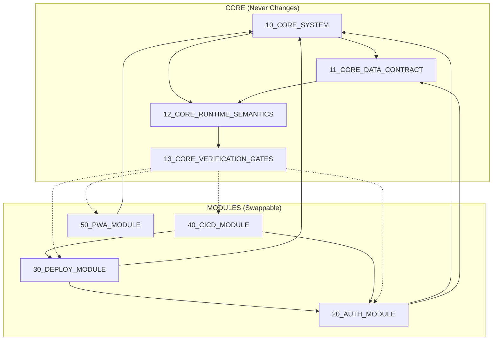

# ProcureFlow Documentation System Index

> **Purpose**: Master index for the modular, plug-and-play documentation system. Enables component swapping without rewriting the entire blueprint.

---

## Architecture Overview

```
┌─────────────────────────────────────────────────────────────────────────┐
│                              CORE SYSTEM                                 │
│  (Provider-agnostic truth: schema, semantics, contracts, invariants)    │
├─────────────────────────────────────────────────────────────────────────┤
│                           MODULE INTERFACES                              │
│  ┌──────────┐  ┌──────────┐  ┌──────────┐  ┌──────────┐               │
│  │   AUTH   │  │  DEPLOY  │  │  CI/CD   │  │   PWA    │               │
│  │ Interface│  │ Interface│  │ Interface│  │ Interface│               │
│  └────┬─────┘  └────┬─────┘  └────┬─────┘  └────┬─────┘               │
└───────┼─────────────┼─────────────┼─────────────┼──────────────────────┘
        │             │             │             │
┌───────▼─────┐ ┌─────▼─────┐ ┌─────▼──────┐ ┌────▼────┐
│  CURRENT:   │ │  CURRENT: │ │  CURRENT:  │ │ CURRENT:│
│  Supabase   │ │   Azure   │ │  GitHub    │ │  PWA    │
│  + Entra ID │ │ App Svc   │ │  Actions   │ │  v1.0   │
└─────────────┘ └───────────┘ └────────────┘ └─────────┘
```

---

## Document Inventory

### Core Documents (Stable - Never Change When Swapping)

| # | File | Purpose |
|---|------|---------|
| 10 | [10_CORE_SYSTEM.md](./10_CORE_SYSTEM.md) | App purpose, user flows, module boundaries |
| 11 | [11_CORE_DATA_CONTRACT.md](./11_CORE_DATA_CONTRACT.md) | Database schema, tables, relationships, indexes |
| 12 | [12_CORE_RUNTIME_SEMANTICS.md](./12_CORE_RUNTIME_SEMANTICS.md) | Multi-site behavior, query patterns, approval gating |
| 13 | [13_CORE_VERIFICATION_GATES.md](./13_CORE_VERIFICATION_GATES.md) | Provider-agnostic smoke tests, invariant checklist |

### Current Provider Modules (Swappable)

| # | File | Module | Current Provider |
|---|------|--------|------------------|
| 20 | [modules/auth/20_AUTH_MODULE_CURRENT.md](./modules/auth/20_AUTH_MODULE_CURRENT.md) | Authentication | Supabase + Azure Entra ID |
| 30 | [modules/deploy/30_DEPLOY_MODULE_AZURE_CURRENT.md](./modules/deploy/30_DEPLOY_MODULE_AZURE_CURRENT.md) | Deployment | Azure App Service |
| 40 | [modules/cicd/40_CICD_MODULE_GITHUB_ACTIONS_CURRENT.md](./modules/cicd/40_CICD_MODULE_GITHUB_ACTIONS_CURRENT.md) | CI/CD | GitHub Actions |
| 50 | [modules/pwa/50_PWA_MODULE_CURRENT.md](./modules/pwa/50_PWA_MODULE_CURRENT.md) | PWA | Service Worker v1 |

### Swap Framework

| # | File | Purpose |
|---|------|---------|
| 90 | [swaps/90_SWAP_FRAMEWORK.md](./swaps/90_SWAP_FRAMEWORK.md) | Module interface contracts, swap procedures |
| 91 | [swaps/91_SWAP_PACK_TEMPLATE.md](./swaps/91_SWAP_PACK_TEMPLATE.md) | Template for creating new swap packs |

### Provider Templates (Empty, Ready for Future Swaps)

| # | File | Purpose |
|---|------|---------|
| 20T | [modules/auth/20_AUTH_MODULE_TEMPLATE.md](./modules/auth/20_AUTH_MODULE_TEMPLATE.md) | Blank auth module template |
| 30T | [modules/deploy/30_DEPLOY_MODULE_TEMPLATE.md](./modules/deploy/30_DEPLOY_MODULE_TEMPLATE.md) | Blank deploy module template |
| 40T | [modules/cicd/40_CICD_MODULE_TEMPLATE.md](./modules/cicd/40_CICD_MODULE_TEMPLATE.md) | Blank CI/CD module template |

---

## Dependency Graph



### Dependency Rules

| Module | Depends On | Provides To |
|--------|------------|-------------|
| AUTH | CORE_SYSTEM, CORE_DATA_CONTRACT | DEPLOY, CICD |
| DEPLOY | CORE_SYSTEM, AUTH | CICD |
| CICD | DEPLOY, AUTH | (Build artifacts) |
| PWA | CORE_SYSTEM | (Offline capability) |

---

## Quick Start: Replicate Current System

Execute in order:

1. **Read** `10_CORE_SYSTEM.md` - Understand app purpose
2. **Apply** `11_CORE_DATA_CONTRACT.md` - Create database
3. **Configure** `20_AUTH_MODULE_CURRENT.md` - Set up Supabase + Entra ID
4. **Configure** `30_DEPLOY_MODULE_AZURE_CURRENT.md` - Create Azure App Service
5. **Configure** `40_CICD_MODULE_GITHUB_ACTIONS_CURRENT.md` - Set up GitHub Actions
6. **Deploy** - Push to `main` branch
7. **Verify** `13_CORE_VERIFICATION_GATES.md` - Run all checks

---

## Quick Start: Swap a Module

1. **Read** `90_SWAP_FRAMEWORK.md` - Understand swap process
2. **Copy** appropriate template from `modules/<type>/*_TEMPLATE.md`
3. **Fill in** provider-specific configuration
4. **Run** module verification gates
5. **Run** system verification gates
6. **Update** this index to reference new module

---

## Evidence Discipline

All documents preserve evidence tags from source material:

| Tag | Meaning |
|-----|---------|
| `[OBSERVED: file:lines]` | Directly verified from source file |
| `[DERIVED: reason]` | Logically inferred from observed facts |
| `[REQUIRES-OPERATOR]` | Human input required; exact steps provided |

When conflicts exist between source documents, `SYSTEM_ARCHITECTURE_COMPLETION_v3.md` is canonical unless marked `[REQUIRES-OPERATOR]`.

---

## Document Metadata

| Field | Value |
|-------|-------|
| Version | 1.0 |
| Created | 2026-02-08 |
| Source Documents | `SYSTEM_ARCHITECTURE_COMPLETION_v3.md`, `REPLICATION_BLUEPRINT.md` |
| Canonical Truth | `SYSTEM_ARCHITECTURE_COMPLETION_v3.md` |
