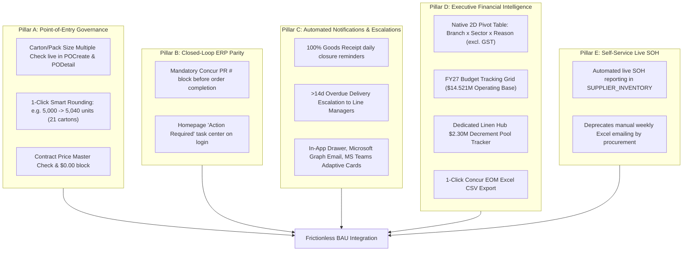

# ProcureFlow Strategic Transformation & Developmental Action Plan (v4.0)

**Document Classification:** Executive Strategy & Operational Governance Roadmap  
**Framework Model:** Previous State $\rightarrow$ Current State (Wins, Challenges, Opportunities) $\rightarrow$ Future Developed State (BAU Integration & Execution)  
**Branch:** [`feature/eom-budget-governance-improvements`](https://github.com/SPLGit-Project/ProcureFlow-App/tree/feature/eom-budget-governance-improvements)  
**Presentation Deck:** [`docs/ProcureFlow_Executive_Roadmap.pptx`](file:///C:/Github/ProcureFlow-App/docs/ProcureFlow_Executive_Roadmap.pptx)  
**Target Cutover:** Production Release following Thursday Workshop  
**Key Governance Committee:**
* **Ebrahim Mokhtari** — *Chief Operating Officer (COO)*
* **Ashish Chhabra** — *Procurement Lead & System Super User*
* **Aaron Bell** — *Tech Lead & ProcureFlow Developer*

---

## Strategic Transformation Executive Model

---

## Act 1: Previous State — What ProcureFlow Provided the Business

Before ProcureFlow, South Pacific Laundry managed national linen ordering through disparate emails, phone calls, and manual spreadsheets. ProcureFlow established the core operational baseline:

1. **Digitized Online Requisitioning:** Replaced fragmented paper and email ordering with a centralized web portal across all laundry sites.
2. **Multi-Site Catalog Routing:** Enabled branch-specific catalog browsing, local delivery address routing, and local manager authorization (Melbourne, Sydney, Brisbane, Perth, Adelaide, Cairns, Mackay, Albury).
3. **Goods Receipt (GR) Tracking:** Established digital delivery logging on site, capturing dockets, delivered quantities, and partial delivery histories.
4. **Basic Financial Categorisation:** Introduced initial taxonomy to distinguish Depletion from New Customer injections.

---

## Act 2: Current State — Wins, Challenges & Strategic Opportunities

### 1. Key Operational Wins Achieved
* **100% Supply Item Code Mapping Milestone:** Completed the full mapping of all SPL internal item codes against supplier vendor codes (Simba, Host, etc.), eliminating naming confusion across branches.
* **National Requisitioning Scale:** Active daily purchasing across all 8 operating entities with standardized audit trails.
* **Supplier Data Feeds:** Built ingestion pipelines for supplier stock-on-hand (SOH) files.

### 2. Current Challenges & Operational Friction Points
* **Manual EOM Excel Crunching:** Ashish Chhabra (Super User) spends days each month extracting Concur reports, stripping GST (`/ 1.1`), manually parsing unstandardized descriptions, and building pivot tables for executive leadership.
* **Unrounded Requisition Quantities:** Site staff order arbitrary quantities (e.g. 5,000 units on a 240 carton size, or 90 units on a 100 pack), causing supplier rejections and manual rework.
* **Contract Pricing Typos:** Keying errors (e.g. 61¢ instead of contracted 51¢ for face washers) cause 3-way matching failures in finance and delayed payments.
* **Missing Concur ERP Linkage:** Orders receipted in ProcureFlow without entering the Concur Request PR #, breaking 1-to-1 data mirroring.
* **Lingering Open Orders:** POs 100% received physically but left open in ProcureFlow.
* **Overdue Shipments:** Deliveries $>14$ days past need-by date sitting unnoticed without line manager visibility.

### 3. The Strategic Opportunity
* **Shift from Passive to Active Governance:** Transform ProcureFlow from a passive recording tool into an intelligent, closed-loop platform with automated guardrails that prevent human error before an order is submitted.
* **Single Source of Truth:** Establish ProcureFlow as the authoritative single source of truth that permanently matches SAP Concur.

---

## Act 3: Future / Target Developed State — Frictionless BAU Integration

### 1. The Vision of BAU Integration & User Engagement
* **For Requesters & Site Staff:** Requisitioning is effortless and error-proof. Packaging multiples are automatically enforced with 1-click rounding, contracted prices auto-populate, and an **"Action Required"** center surfaces open tasks upon login.
* **For Procurement (Ashish Chhabra):** Zero rework from supplier rejections; zero manual EOM Excel building; self-service SOH removes manual weekly emailing.
* **For Executive Leadership (Ebrahim Mokhtari, COO):** Complete commercial control with live FY27 budget burn rates (\$14.521M), real-time \$2.3M Linen Hub tracking, and 100% financial alignment with SAP Concur.

---

### 2. Core Development Pillars Delivered to Achieve the Vision

---

## 4. Thursday Executive Workshop Agenda & Presentation Flow

**Date & Time:** Thursday 12:00 PM – 2:00 PM  
**Presenters:** Aaron Bell & Ashish Chhabra  
**Executive Reviewer & Sign-Off:** Ebrahim Mokhtari (COO)

| Agenda Part | Time Window | Focus Area & Live Demonstration | Session Leads |
| :--- | :--- | :--- | :--- |
| **Part 1: Point-of-Entry Governance** | 12:00 – 12:30 PM | • Live demo of `POCreate`: Carton multiple rounding & price checks  • Presentation of 100% Item Code Mapping Milestone | Aaron Bell & Ashish Chhabra |
| **Part 2: DOA Approvals & Escalation** | 12:30 – 1:00 PM | • DOA approval tiers & Approval Review Wizard demo  • 100% receipt closure nudges & >14d overdue manager escalation  • Mandatory Concur PR # rule on completion | Ashish Chhabra & Aaron Bell |
| **Part 3: Executive EOM Reconciliation** | 1:00 – 1:30 PM | • Live 2D Pivot Table (Branch $\times$ Sector $\times$ Reason)  • FY27 Budget vs Actuals grid & Linen Hub \$2.3M tracker  • 1-Click Concur EOM Excel CSV export | Ashish Chhabra & Aaron Bell |
| **Part 4: SOH & Production Sign-Off** | 1:30 – 2:00 PM | • Automated SOH live reporting  • Synthesis of stakeholder feedback  • **Formal production cutover sign-off by Ebrahim Mokhtari (COO)** | Ebrahim Mokhtari (COO) |

---

## 5. Stakeholder Review Checklist Ahead of Workshop

* [ ] **Ashish Chhabra (Procurement Lead / Super User):**
  * Reconcile August & September 2026 EOM Pivot numbers in ProcureFlow against `Purchase Request EOM SEP-26.xls`.
  * Export the system SOH report and verify line-by-line parity with the manual weekly report.
  * Test carton multiple rounding in `POCreate`.
* [ ] **Aaron Bell (Tech Lead / Developer):**
  * Verify staging environment on `feature/eom-budget-governance-improvements`.
  * Prepare live demonstration walk-through and test datasets.
* [ ] **Ebrahim Mokhtari (COO):**
  * Review national FY27 budget burn rates (\$14.521M), commercial governance rules, and grant formal production sign-off.
