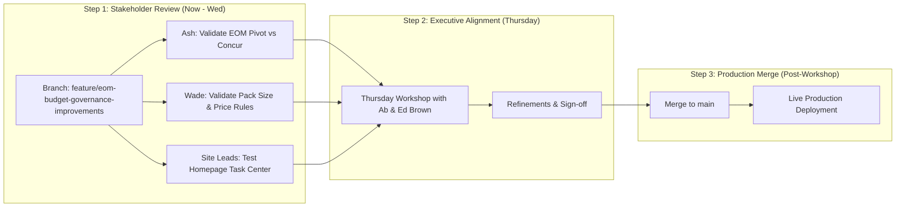
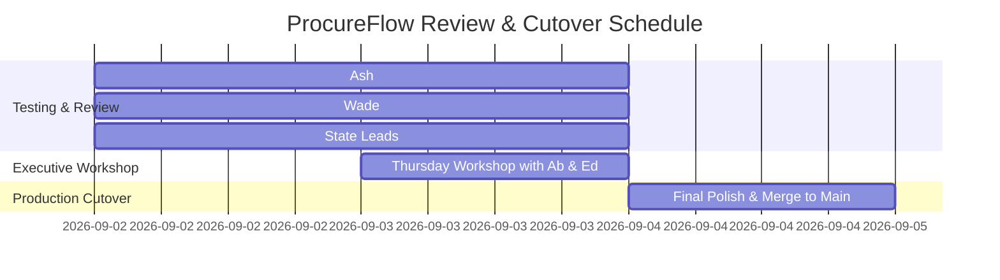

# ProcureFlow Developmental Action & Stakeholder Review Plan

**Branch:** [`feature/eom-budget-governance-improvements`](https://github.com/SPLGit-Project/ProcureFlow-App/tree/feature/eom-budget-governance-improvements)  
**Target Cutover:** Production Release following Thursday Workshop  
**Document Version:** 1.0 (September 1, 2026)  
**Authors / Leads:** Aaron Bell & Development Team  
**Key Reviewers:** Ash (Super User), Wade (Procurement Lead), Ab (Executive Sponsor), Edmund Brown (Operations & Strategy)

---

## 1. Executive Summary & Objective

Following the deep-dive super user sessions on August 28 & 31, 2026, ProcureFlow has been upgraded to resolve critical data integrity bottlenecks, automate month-end financial reconciliation, and enforce business rules at the point of order creation.

All updates have been isolated on the preview branch `feature/eom-budget-governance-improvements` on GitHub. This document provides the structured **Review & Refinement Action Plan** for stakeholders to test, provide feedback, and sign off before merging into the production `main` branch.



---

## 2. Comprehensive Deliverables Overview

### Area 1: Executive EOM Spend & Budget Reconciliation Engine
| Capability | Business Impact | Key Verification Focus |
| :--- | :--- | :--- |
| **2D Pivot Matrix (Branch × Sector × Reason)** | Replicates Ash's Concur EOM workbook automatically inside ProcureFlow, eliminating manual Excel crunching. | Compare ProcureFlow pivot rows against Ash's August & September 2026 Excel reports. |
| **FY27 Baseline Budget Matrix (\$14.521M)** | Site-by-site actuals vs monthly budgets (\$826.8k/mo Depletion, \$191.7k/mo New Business) with live burn rates. | Confirm site budget splits (Melbourne \$2.654M, Sydney \$2.784M, etc.). |
| **Dedicated Linen Hub Pool (\$2.30M)** | Live decrement tracking against the dedicated \$2.30M budget pool. | Confirm remaining balance matches latest purchase requisitions. |
| **Strategic Contract Breakouts** | Dedicated YTD totals for HealthShare Victoria (HSV) and Ramsay Health Care (RHC). | Verify correct contract stream classification. |
| **1-Click Concur EOM CSV Export** | Produces leadership-ready spreadsheet exports instantly. | Test CSV generation and verify columns match finance reporting needs. |

---

### Area 2: PO Submission Input Governance & Blocking Rules
| Capability | Business Impact | Key Verification Focus |
| :--- | :--- | :--- |
| **Carton / Pack Size Multiple Enforcement** | Prevents staff from submitting arbitrary quantities (e.g. 5,000 units on a 240 carton size). | Test creating orders with non-multiple quantities in `POCreate` $\rightarrow$ verify block alert and smart rounding button (e.g., Round to 5,040). |
| **Contract Pricing Validation** | Blocks orders with \$0.00 or invalid catalog pricing, eliminating invoice variances. | Test entering \$0.00 unit price $\rightarrow$ verify submission block. |

---

### Area 3: Mandatory Concur Reference Validation
| Capability | Business Impact | Key Verification Focus |
| :--- | :--- | :--- |
| **Mandatory Concur PR / PO # Block on Closure** | Prohibits closing or completing POs in ProcureFlow without entering the Concur reference number. Ensures 100% ERP tracking alignment. | Attempt to complete an order in `PODetail` with missing Concur number $\rightarrow$ verify blocking dialog. |

---

### Area 4: Homepage "Action Required" Task Center
| Capability | Business Impact | Key Verification Focus |
| :--- | :--- | :--- |
| **Operational Task Summary** | Surfaces pending tasks directly upon login: <br/>1. Log Concur PR # (Approved orders awaiting ERP link) <br/>2. Ready for Order Closure (100% delivered orders) <br/>3. Overdue Deliveries (>14 days past need-by date) | Verify live counts and 1-click navigation directly to filtered stages. |

---

## 3. Stakeholder Review Action Items & Responsibilities



### A. Ash (Super User & Financial Reconciler)
- [ ] Log into the review branch / staging environment and navigate to **Reports $\rightarrow$ EOM Spend & Budget Reconciliation**.
- [ ] Select **August 2026** and **September 2026** reconciliation periods.
- [ ] Cross-check the **Pivot Table totals** against your `Purchase Request EOM SEP-26.xls` workbook.
- [ ] Download the **Concur EOM CSV Export** and confirm formatting satisfies CFO / Andrew / Ab requirements.

### B. Wade (National Procurement Lead)
- [ ] Test the **New Request (`POCreate`)** flow:
  - Add items with known carton quantities (e.g. 240, 100).
  - Attempt to input unrounded quantities (e.g. 500, 5,000) and verify the 1-click rounder button works smoothly.
- [ ] Review the **Supplier Inventory (`SUPPLIER_INVENTORY`)** report to confirm stock on hand displays match latest SIMBA/HOST extracts.

### C. State Operations Managers & Requesters
- [ ] Review the **Home Dashboard**:
  - Check the **Action Required** banner.
  - Verify that clicking each task card filters directly to the appropriate orders needing attention.

### D. Executive Leadership (Ab & Edmund Brown - Thursday Workshop)
- [ ] Review the 4 pillars during Thursday's executive session:
  1. Input Governance (Zero-defect ordering).
  2. Lifecycle Governance (Mandatory Concur linkage).
  3. Executive EOM Reconciliation (Real-time single source of truth).
  4. Exception Management (Action Required & Overdue escalation).
- [ ] Grant formal sign-off for merging to `main`.

---

## 4. How to Test & Access the Review Branch

* **GitHub Branch URL**: [ProcureFlow-App on `feature/eom-budget-governance-improvements`](https://github.com/SPLGit-Project/ProcureFlow-App/tree/feature/eom-budget-governance-improvements)
* **Create PR in GitHub**: [Click here to open PR to `main`](https://github.com/SPLGit-Project/ProcureFlow-App/pull/new/feature/eom-budget-governance-improvements)
* **Local Run**:
  ```bash
  git fetch origin
  git checkout feature/eom-budget-governance-improvements
  npm install
  npm run dev
  ```

---

## 5. Feedback & Iteration Log

| Stakeholder | Feedback / Requested Adjustment | Priority | Status |
| :--- | :--- | :--- | :--- |
| *Ash* | *Awaiting review notes on August/September numbers* | High | Pending Review |
| *Wade* | *Awaiting review notes on pack multiples & supplier SOH* | High | Pending Review |
| *Ab / Ed* | *Scheduled for Thursday Alignment Workshop* | Critical | Scheduled |
