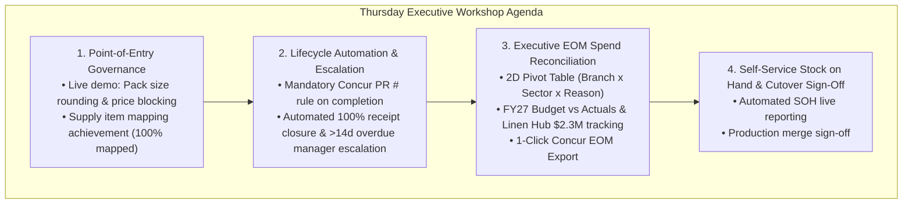

# ProcureFlow Developmental Action & Stakeholder Review Plan (v2.0)

**Branch:** [`feature/eom-budget-governance-improvements`](https://github.com/SPLGit-Project/ProcureFlow-App/tree/feature/eom-budget-governance-improvements)  
**Target Cutover:** Production Release following Thursday Workshop  
**Document Version:** 2.0 (Updated September 1, 2026 post August 31 Meeting Review)  
**Authors / Leads:** Aaron Bell & Development Team  
**Key Reviewers:** Ash (Super User & Reconciler), Wade (National Procurement Lead), Ab (Executive Sponsor), Edmund Brown (Operations & Strategy)

---

## 1. Executive Summary & Context

Following the deep-dive super user alignment meetings on **Friday August 28** and **Monday August 31, 2026**, ProcureFlow has been upgraded to establish a closed-loop procurement ecosystem.

All updates are isolated on the preview branch `feature/eom-budget-governance-improvements` on GitHub. This document provides the complete **Developmental Action & Review Plan** incorporating the technical deliverables, business rules, manager escalation hierarchies, and the executive agenda for the **Thursday Alignment Workshop with Ab and Edmund Brown (Ed)**.

```mermaid
flowchart LR
    subgraph InputControl ["1. Point-of-Entry Governance"]
        A["Carton Size Multiple Enforcement"]
        B["Contract Price Master Check"]
        C["Supply Item Mapping (100% Linked)"]
    end

    subgraph OperationsControl ["2. Lifecycle & ERP Parity"]
        D["Mandatory Concur PR # Enforcement"]
        E["100% Received Closure Nudges"]
        F["Overdue (>14d) Manager Escalation"]
    end

    subgraph ExecutiveControl ["3. Executive Intelligence"]
        G["EOM 2D Pivot Reconciliation"]
        H["FY27 Budget Variance ($14.521M Base)"]
        I["Automated SOH vs Manual Verification"]
    end

    InputControl --> OperationsControl --> ExecutiveControl
```



---

## 2. Detailed Improvement Deliverables & Logic

### 1. PO Input Governance & Submission Blocking Rules
* **Carton / Pack Size Multiple Enforcement:**
  * **Business Rule:** PO submissions are blocked unless line quantities are exact multiples of item master carton/pack sizes (`cartonQty` / `upq`).
  * **Examples Enforced:**
    * If carton size is 240 units, ordering 5,000 units is blocked $\rightarrow$ Prompt suggests **5,040 units (21 cartons)**.
    * If pack size is 100 units, ordering 90 or 110 units is blocked $\rightarrow$ Forces full pack multiples.
  * **User Experience:** Instant red error callout with a 1-click **"Round to X units"** button on both [`POCreate.tsx`](file:///C:/Github/ProcureFlow-App/components/POCreate.tsx) and [`PODetail.tsx`](file:///C:/Github/ProcureFlow-App/components/PODetail.tsx).
* **Contracted Price Master Validation:**
  * **Business Rule:** Unit price entered is compared against contracted supplier catalog pricing.
  * **Behavior:** Blocks orders with \$0.00 or uncontracted price deviations (e.g. keying in 61¢ instead of contracted 51¢ for face washers).
* **Supply Item Code Mapping Milestone:**
  * Leveraging the completed mapping of 100% of SPL internal item codes against vendor item codes (Simba, Host, etc.) to guarantee seamless catalog lookups.

---

### 2. PO Lifecycle Notifications & Escalation Hierarchy
* **100% Physical Goods Receipt Closure Reminders:**
  * **Trigger:** When physical delivery receipting reaches 100% (`quantityReceived >= quantityOrdered`), but the PO remains open.
  * **Action:** Automated daily reminder sent to requester: *"PO #XXX is 100% received. Please review and complete this order."*
  * **Variance Handling:** If delivery quantities deviate from ordered quantities, prompts requester to contact **Ash / Kiran** to amend order line quantities before final closure.
* **Overdue Delivery Escalation (> 14 Days):**
  * **Trigger:** PO line item `needByDate` is $> 14$ days overdue and `quantityReceived < quantityOrdered`.
  * **Tiered Escalation Matrix:**
    * **Tier 1 (Day 15):** In-App and Email alert to requester prompting for updated `needByDate` or supplier cancellation.
    * **Tier 2 (Day 21):** Escalation notification copying the relevant State / Regional Operations Manager:
      * *Melbourne / Albury Requesters (e.g. Katrina, Braun)* $\rightarrow$ Copied to **David**.
      * *National / Other Sites* $\rightarrow$ Copied to **Wade / State Operations Leads**.
  * **Delivery Channels:** In-App Notification Center, Email (Microsoft Graph), and Microsoft Teams Power Automate webhook adaptive cards.

---

### 3. Concur Reference Number Enforcement & Homepage Task Center
* **Mandatory Concur PR Number Block on Order Completion:**
  * **Business Rule:** Prohibits closing, reconciling, or completing any PO in [`PODetail.tsx`](file:///C:/Github/ProcureFlow-App/components/PODetail.tsx) unless `concurRequestNumber` or `concurPoNumber` is entered.
  * **Impact:** Guarantees 100% data parity between SAP Concur and ProcureFlow; prevents untracked orders.
* **Homepage "Action Required" Task Center ([`Home.tsx`](file:///C:/Github/ProcureFlow-App/components/Home.tsx)):**
  * Top-level banner displaying real-time operational actionable tasks:
    1. **Log Concur PR #:** Count of approved requests awaiting Concur linkage (1-click to Stage 2).
    2. **Ready for Order Closure:** Count of 100% delivered orders awaiting closure (1-click to Stage 5).
    3. **Overdue Deliveries:** Count of orders $>14$ days past need-by date (1-click to Stage 4).

---

### 4. Executive EOM Spend & Budget Reconciliation Engine
* **2D Cross-Tabulation Pivot Matrix:** Replicates Ash's Concur EOM workbook layout (Branch $\times$ Sector $\times$ Reason) excluding GST (`Total / 1.1`).
* **FY27 Baseline Budget Matrix (\$14.521M Total):**
  * Melbourne (\$2.654M), Sydney (\$2.784M), Adelaide (\$920k), Brisbane (\$1.031M), Cairns (\$706k), Mackay (\$349k), Perth (\$996k), Albury (\$481k).
  * Monthly burn rates tracking against \$826.8k/mo Depletion and \$191.7k/mo New Business targets.
* **Dedicated Linen Hub \$2.30M Pool Decrement Tracker:** Real-time remaining balance and YTD injection monitoring.
* **Strategic Contracts Breakout:** Real-time YTD figures for HealthShare Victoria (HSV) and Ramsay Health Care (RHC).
* **Multi-Facility Order Transparency (e.g. Melbourne/Simba National Gift Order):**
  * Explicit site attribution rules ensuring national distribution orders raised under one branch for national delivery (e.g. Perth/Sydney) are transparently identifiable in site reports.

---

### 5. Automated Stock-on-Hand (SOH) Report Verification Protocol
* **Current Bottleneck:** Wade manually cleans, formats, and emails weekly SOH Excel sheets to state managers.
* **Automation Workflow:** ProcureFlow's automated SOH report (`SUPPLIER_INVENTORY`) pulls live stock feeds.
* **Verification Action:** Ash and Wade to export the system SOH report, compare line-by-line with Wade's manually distributed report, and confirm 100% accuracy to deprecate the manual emailing process.

---

## 3. Agenda & Presentation Flow for Thursday Workshop (Ab & Edmund Brown)

The Thursday 2-hour executive session (12:00 PM – 2:00 PM) will present ProcureFlow as the **authoritative single source of truth** for national linen procurement.



### Core Message for Executive Leadership:
> *"ProcureFlow eliminates human data errors at the point of request entry through strict packaging and price governance. Automated lifecycle notifications and mandatory Concur reference rules guarantee continuous reconciliation between SAP Concur and ProcureFlow in real time."*

---

## 4. Stakeholder Action Items & Sign-Off Matrix

| Stakeholder | Pre-Workshop Verification Task | Workshop Role | Sign-Off Target |
| :--- | :--- | :--- | :--- |
| **Ash** *(Super User)* | Reconcile August & September 2026 EOM Pivot numbers against `Purchase Request EOM SEP-26.xls`. | Co-present EOM Pivot accuracy & 1-Click export | Wednesday 5:00 PM |
| **Wade** *(Procurement Lead)* | Test carton multiple validation in `POCreate` & compare system SOH against manual email extracts. | Co-present Input Governance & SOH Automation | Wednesday 5:00 PM |
| **Aaron Bell** *(Tech Lead)* | Align with Wade/Ash at Wednesday 11:00 AM prep meeting; lead live software walkthrough on Thursday. | Live System Demonstration | Thursday Workshop |
| **Ab & Edmund Brown** | Review governance controls, budget burn rates, and approve final production cutover. | Executive Sign-off | Thursday Post-Workshop |

---

## 5. Branch Access & Testing Instructions

* **GitHub Branch URL:** [`feature/eom-budget-governance-improvements`](https://github.com/SPLGit-Project/ProcureFlow-App/tree/feature/eom-budget-governance-improvements)
* **Local Run:**
  ```bash
  git fetch origin
  git checkout feature/eom-budget-governance-improvements
  npm install
  npm run dev
  ```
