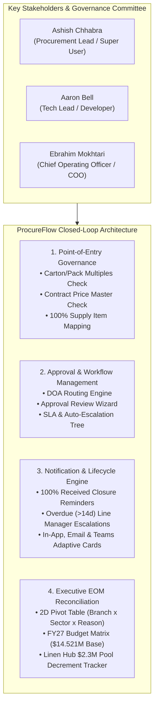
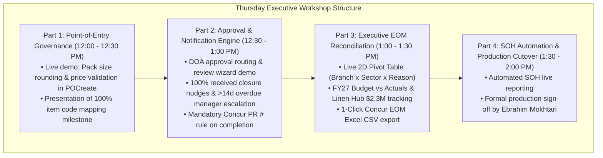

# ProcureFlow Master Developmental Action & Stakeholder Review Plan (v3.0)

**Branch:** [`feature/eom-budget-governance-improvements`](https://github.com/SPLGit-Project/ProcureFlow-App/tree/feature/eom-budget-governance-improvements)  
**Target Cutover:** Production Release following Thursday Workshop  
**Document Version:** 3.0 (Comprehensive Revision — Governance, Approvals & Notifications)  
**Key Stakeholders & Governance Committee:**
1. **Ashish Chhabra** — *Procurement Lead & System Super User*
2. **Aaron Bell** — *Tech Lead & ProcureFlow Developer*
3. **Ebrahim Mokhtari** — *Chief Operating Officer (COO)*

---

## 1. Executive Summary & Context

Following alignment sessions on August 28 & 31, 2026, ProcureFlow is being established as the **authoritative single source of truth** for South Pacific Laundry (SPL) national linen procurement.

All code updates are isolated on the preview branch `feature/eom-budget-governance-improvements` on GitHub. This document details the **Developmental Action & Review Plan** for **Ashish Chhabra**, **Aaron Bell**, and **Ebrahim Mokhtari** ahead of the **Thursday Executive Workshop**.



---

## 2. Pillar Breakdown & Technical Specifications

### Pillar 1: PO Point-of-Entry Governance & Submission Blocking Rules
* **Carton / Pack Size Multiple Enforcement:**
  * **Rule:** PO line submissions are blocked unless `quantityOrdered` is an exact multiple of the item's `cartonQty` or `upq`.
  * **Operational Examples:**
    * Ordering 5,000 units on a 240 carton size $\rightarrow$ Blocked with red alert; 1-click button rounds to **5,040 units (21 cartons)**.
    * Ordering 90 or 110 units on a 100 pack size $\rightarrow$ Blocked; forces 100 or 200 units.
  * **Files Updated:** [`components/POCreate.tsx`](file:///C:/Github/ProcureFlow-App/components/POCreate.tsx), [`components/PODetail.tsx`](file:///C:/Github/ProcureFlow-App/components/PODetail.tsx), [`types.ts`](file:///C:/Github/ProcureFlow-App/types.ts).
* **Contract Price Master Validation:**
  * **Rule:** Compares line prices against active supplier price schedules and catalog items.
  * **Behavior:** Blocks submission if unit price is \$0.00 or deviates from contracted rates (e.g., entering 61¢ instead of contracted 51¢ for face washers).
* **100% Supply Item Code Mapping Milestone:**
  * Milestone achieved: All SPL internal item codes are mapped to vendor item codes (Simba, Host, etc.), guaranteeing accurate catalog lookups and automated pricing validation.

---

### Pillar 2: Approval Workflow Management & Delegation of Authority (DOA)
* **DOA-Based Multi-Tier Approval Routing:**
  * Evaluates purchase requests against corporate Delegation of Authority (DOA) rules:
    * **Tier 1 (Site / Operations Approval):** Site Managers approve baseline branch requests within delegated operational thresholds.
    * **Tier 2 (Procurement Lead Approval — Ashish Chhabra):** Reviews spend reason (Depletion vs New Business vs Linen Hub), verifies pack sizes, and validates catalog pricing parity.
    * **Tier 3 (Executive Approval — Ebrahim Mokhtari, COO):** Required for high-value orders (e.g. $>\$50,000$), New Customer linen injection projects, or unbudgeted threshold exceptions.
* **Approval Review Wizard & Queue:**
  * Approvers utilize [`components/ApprovalQueue.tsx`](file:///C:/Github/ProcureFlow-App/components/ApprovalQueue.tsx) and [`components/ApprovalReviewWizard.tsx`](file:///C:/Github/ProcureFlow-App/components/ApprovalReviewWizard.tsx) to inspect GST-inclusive totals, line item carton splits, historical burn rates, and approve/reject/escalate with mandatory audit comments.

---

### Pillar 3: Automated Notifications & Escalation Management
* **100% Goods Receipt (GR) Closure Reminders:**
  * **Trigger:** Physical delivery reaches 100% (`quantityReceived >= quantityOrdered`), but the PO remains open in ProcureFlow.
  * **Action:** Automated daily reminder sent to requester: *"PO #XXX is 100% received. Please review and complete this order."*
  * **Variance Resolution:** If received quantities do not match ordered quantities, prompts requester to contact **Ashish Chhabra** to amend order line quantities before completing.
* **Overdue Delivery Escalation (> 14 Days):**
  * **Trigger:** A PO line item `needByDate` is $> 14$ days overdue and `quantityReceived < quantityOrdered`.
  * **Escalation Hierarchy:**
    * **Tier 1 (Day 15):** Notification sent to requester prompting for updated `needByDate` or supplier cancellation.
    * **Tier 2 (Day 21):** Escalation notification copying line managers:
      * *Melbourne / Albury Requesters (e.g. Katrina, Braun)* $\rightarrow$ Copied to **David**.
      * *National / Other Sites* $\rightarrow$ Copied to **Ashish Chhabra** and **Ebrahim Mokhtari**.
* **Multi-Channel Dispatch Platform:**
  * **In-App Notification Center:** Live slide-over drawer with real-time badges on [`components/WorkflowNotificationHub.tsx`](file:///C:/Github/ProcureFlow-App/components/WorkflowNotificationHub.tsx).
  * **Microsoft Graph Email:** Clean branded HTML emails with direct action links.
  * **Microsoft Teams Power Automate Webhooks:** Adaptive Cards v1.4 with interactive decision buttons sent to dedicated operational channels.

---

### Pillar 4: Concur Reference Enforcement & Homepage Task Center
* **Mandatory Concur PR # Validation on Order Completion:**
  * **Rule:** Prohibits transitioning any PO to `'CLOSED'` or completed in [`components/PODetail.tsx`](file:///C:/Github/ProcureFlow-App/components/PODetail.tsx) unless `concurRequestNumber` or `concurPoNumber` is entered.
  * **Impact:** Guarantees 1-to-1 parity with SAP Concur; eliminates missing ERP references.
* **Homepage "Action Required" Task Center ([`components/Home.tsx`](file:///C:/Github/ProcureFlow-App/components/Home.tsx)):**
  * Immediate banner upon login showing:
    1. **Log Concur PR #:** Approved orders awaiting ERP linkage (1-click to Stage 2).
    2. **Ready for Order Closure:** 100% delivered orders awaiting closure (1-click to Stage 5).
    3. **Overdue Deliveries:** Shipments $>14$ days past need-by date (1-click to Stage 4).

---

### Pillar 5: Executive EOM Spend & Budget Reconciliation Engine
* **2D Cross-Tabulation Pivot Matrix:** Replicates Ashish's Concur EOM workbook (Branch $\times$ Sector $\times$ Category) excluding GST (`Total / 1.1`).
* **FY27 Baseline Budget Matrix (\$14.521M Total):**
  * Melbourne (\$2.654M), Sydney (\$2.784M), Adelaide (\$920k), Brisbane (\$1.031M), Cairns (\$706k), Mackay (\$349k), Perth (\$996k), Albury (\$481k).
  * Monthly burn rates tracking against \$826.8k/mo Depletion and \$191.7k/mo New Business targets.
* **Dedicated Linen Hub \$2.30M Pool Decrement Tracker:** Real-time remaining balance monitoring.
* **Strategic Contracts Breakout:** Real-time YTD figures for HealthShare Victoria (HSV) and Ramsay Health Care (RHC).
* **1-Click Concur EOM Export:** Produces leadership-ready spreadsheet exports instantly.
* **Multi-Facility Order Transparency (e.g. Melbourne/Simba National Order):**
  * Clear multi-site attribution preventing cost disputes between site managers.

---

### Pillar 6: Automated Stock-on-Hand (SOH) Verification Protocol
* **Verification Protocol:** Ashish Chhabra to export the system SOH report from ProcureFlow (`SUPPLIER_INVENTORY`), compare line-by-line against current manual Excel distributions, confirm accuracy, and retire manual emailing.

---

## 3. Agenda & Presentation Flow for Thursday Workshop

**Time:** Thursday 12:00 PM – 2:00 PM  
**Presenters:** Aaron Bell & Ashish Chhabra  
**Executive Reviewer & Sign-Off:** Ebrahim Mokhtari (COO)



---

## 4. Stakeholder Action Items & Sign-Off Schedule

| Stakeholder | Pre-Workshop Verification Task | Workshop Role | Sign-Off Target |
| :--- | :--- | :--- | :--- |
| **Ashish Chhabra** *(Procurement Lead / Super User)* | Reconcile August & September 2026 EOM Pivot numbers against `Purchase Request EOM SEP-26.xls` and test packaging rules in `POCreate`. | Co-present EOM Pivot accuracy, packaging rules, and 1-Click export | Wednesday 5:00 PM |
| **Aaron Bell** *(Tech Lead / Developer)* | Prepare live demo environment on `feature/eom-budget-governance-improvements`; verify build and database parity. | Lead live technical walkthrough & system demonstrations | Wednesday 5:00 PM |
| **Ebrahim Mokhtari** *(Chief Operating Officer / COO)* | Review end-to-end governance, DOA approval tiers, budget burn rates, and approve final production cutover. | Executive Chair & Final Sign-Off | Thursday Workshop |

---

## 5. Branch Access & Local Testing

* **GitHub Branch URL:** [`feature/eom-budget-governance-improvements`](https://github.com/SPLGit-Project/ProcureFlow-App/tree/feature/eom-budget-governance-improvements)
* **Local Run:**
  ```bash
  git fetch origin
  git checkout feature/eom-budget-governance-improvements
  npm install
  npm run dev
  ```
