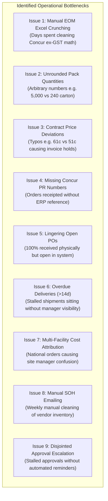
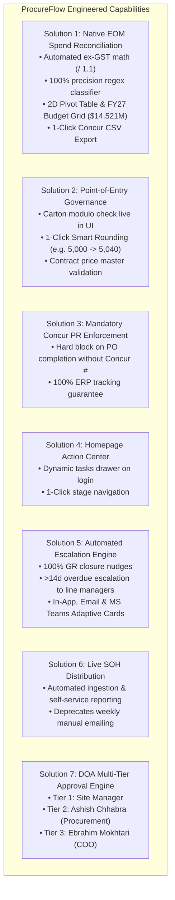

# ProcureFlow Comprehensive Issues, Operational Context & Engineered Solutions Compendium

**Document Classification:** Master Strategic & Technical Analysis  
**Repository Branch:** [`feature/eom-budget-governance-improvements`](https://github.com/SPLGit-Project/ProcureFlow-App/tree/feature/eom-budget-governance-improvements)  
**Document Version:** 1.0 (September 2, 2026)  
**Authors & Contributors:** Aaron Bell (Tech Lead / Developer) & Ashish Chhabra (Procurement Lead / Super User)  
**Executive Reviewer:** Ebrahim Mokhtari (Chief Operating Officer / COO)

---

## Table of Contents
1. [Executive Overview & Context](#1-executive-overview--context)
2. [Detailed Issue Catalog & Root Cause Analysis](#2-detailed-issue-catalog--root-cause-analysis)
   - [Issue 1: Manual Month-End (EOM) Reconciliation Bottleneck](#issue-1-manual-month-end-eom-reconciliation-bottleneck)
   - [Issue 2: Arbitrary Order Quantities & Packaging Disconnect](#issue-2-arbitrary-order-quantities--packaging-disconnect)
   - [Issue 3: Contracted Pricing Deviations & Invoice Mismatches](#issue-3-contracted-pricing-deviations--invoice-mismatches)
   - [Issue 4: Missing Concur Reference Numbers on Order Closure](#issue-4-missing-concur-reference-numbers-on-order-closure)
   - [Issue 5: Lingering Open Purchase Orders Post-Delivery](#issue-5-lingering-open-purchase-orders-post-delivery)
   - [Issue 6: Unmonitored Overdue Deliveries (>14 Days)](#issue-6-unmonitored-overdue-deliveries-14-days)
   - [Issue 7: Multi-Facility Order Attribution & Site Cost Disputes](#issue-7-multi-facility-order-attribution--site-cost-disputes)
   - [Issue 8: Manual Stock-on-Hand (SOH) Distribution Overhead](#issue-8-manual-stock-on-hand-soh-distribution-overhead)
   - [Issue 9: Disjointed Approval Routing & Lack of Escalation Hierarchy](#issue-9-disjointed-approval-routing--lack-of-escalation-hierarchy)
3. [Engineered Solutions & Technical Architecture](#3-engineered-solutions--technical-architecture)
   - [Solution 1: Executive EOM Spend & Budget Reconciliation Engine](#solution-1-executive-eom-spend--budget-reconciliation-engine)
   - [Solution 2: Point-of-Entry Input Governance & Submission Blocking Rules](#solution-2-point-of-entry-input-governance--submission-blocking-rules)
   - [Solution 3: Mandatory Concur Reference Validation](#solution-3-mandatory-concur-reference-validation)
   - [Solution 4: Homepage "Action Required" Operational Task Center](#solution-4-homepage-action-required-operational-task-center)
   - [Solution 5: Automated Notifications & Multi-Tier Escalation Hierarchy](#solution-5-automated-notifications--multi-tier-escalation-hierarchy)
   - [Solution 6: Self-Service Live Stock on Hand (SOH) Distribution](#solution-6-self-service-live-stock-on-hand-soh-distribution)
   - [Solution 7: Delegation of Authority (DOA) Approval Engine](#solution-7-delegation-of-authority-doa-approval-engine)
4. [The 3-Act Strategic Transformation Framework](#4-the-3-act-strategic-transformation-framework)
5. [Thursday Executive Workshop Agenda & Cutover Plan](#5-thursday-executive-workshop-agenda--cutover-plan)
6. [Verification, Parity Tests & Code Locations](#6-verification-parity-tests--code-locations)

---

## 1. Executive Overview & Context

South Pacific Laundry (SPL) operates a nationwide network of commercial laundry facilities servicing healthcare, hospital networks, hospitality, and mining sectors across 8 major regional hubs: Melbourne, Sydney, Brisbane, Perth, Adelaide, Cairns, Mackay, and Albury.

Procurement of commercial linen represents one of SPL's largest operational and capital expenditures, governed by a total **FY27 baseline operating budget of \$14,521,000**:
* **Depletion Spend (Baseline Replacement):** \$9,921,000 annually (\$826,750 / month)
* **New Business Capital Pool (Customer Growth):** \$2,300,000 annually (\$191,667 / month)
* **Linen Hub Dedicated Allocation Pool:** \$2,300,000 annually (Dedicated multi-year replenishment pool)

Historically, procurement tracking was split across disparate spreadsheets, email threads, and SAP Concur purchase requisitions. ProcureFlow was initially created to digitize the requisition process. However, operational friction, human data entry errors, and disconnected workflows emerged, requiring significant manual effort by the Procurement Lead (**Ashish Chhabra**) to clean data, re-calculate spend, and build monthly pivot summaries for executive leadership (**Ebrahim Mokhtari, COO**).

Through deep-dive alignment meetings held on **Friday August 28** and **Monday August 31, 2026**, all underlying operational issues were analyzed and a closed-loop engineering roadmap was established. This document details every identified issue, its business impact, the exact root cause, and the complete technical solution implemented.

---

## 2. Detailed Issue Catalog & Root Cause Analysis



---

### Issue 1: Manual Month-End (EOM) Reconciliation Bottleneck

#### Context & Operational Evidence
In the meeting of August 28, 2026, Ashish Chhabra demonstrated his monthly tracking process, sharing three master workbooks:
1. `Aaron File Concur Data 28.08.2026.xls` (919 master historical Concur PO records).
2. `Purchase Request EOM SEP-26.xls` (EOM transformation model with 4 sheets: `Raw Data`, `SEP TO DATE`, `Pivot`, and `FY27 BUDGET`).
3. `GRAPH EOM TRACKING - 01.10.2026.xlsx` (Multi-year tracking workbook comparing monthly spend to budget run rates).

#### Root Cause Analysis
To produce monthly financial figures for the COO and CFO, Ashish had to execute a multi-step manual workflow:
1. **Manual Concur Export:** Extract raw purchase requests from SAP Concur, filtering on `DOA list = 'Linen Purchase per Document'`.
2. **GST Stripping:** Concur records include 10% GST. Finance and management track spend **strictly excluding GST**. Ashish manually applied the formula `=G2 / 1.1` to strip GST on every line.
3. **Branch Normalization:** Operating entities were inconsistently referenced in text strings (e.g. `VIC`, `MEL`, `MELBOURNE`, `Albury`, `ALB`). Ashish had to manually derive the branch code using complex nested Excel formulas:
   ```excel
   =IF(ISNUMBER(SEARCH("ALB", E2)), "ALB",
    IF(ISNUMBER(SEARCH("MEL", E2)), "MEL",
    IF(ISNUMBER(SEARCH("SYD", E2)), "SYD",
    IF(ISNUMBER(SEARCH("BRIS", E2)), "BRIS",
    IF(ISNUMBER(SEARCH("PER", E2)), "PER",
    IF(ISNUMBER(SEARCH("ADE", E2)), "ADE",
    IF(ISNUMBER(SEARCH("CNS", E2)), "CNS",
    IF(ISNUMBER(SEARCH("MKY", E2)), "MKY", "MEL"))))))))
   ```
4. **Sector Categorisation (Accommodation vs Healthcare):** No dedicated field existed in legacy Concur data. Ashish manually parsed single-letter indicators in free-text PO description strings (`- A -` for Accommodation vs `- H -` for Healthcare).
5. **Spend Category Parsing (Depletion vs New Business vs Linen Hub):** Requisitions contained arbitrary text tokens like `NB`, `New B`, `New Business`, `DEP`, `Depletion`, or `HOL / Linen Hub`. Ashish had to manually inspect each string to group spend.
6. **2D Pivot Table Assembly:** Ashish assembled a cross-tabulation table cross-referencing:
   $$\text{Branch} \times \text{Sector (Accommodation, Healthcare)} \times \text{Category (Depletion, New Business, Linen Hub)}$$
   This manual process took 2 to 3 days each month and was vulnerable to copy-paste formula errors.

---

### Issue 2: Arbitrary Order Quantities & Packaging Disconnect

#### Context & Operational Evidence
In the meeting of August 31, 2026, Ashish shared his screen displaying two purchase orders he had been forced to reject that morning:
* **The Incident:** A laundry site submitted a PO for **5,000 units** of a face washer.
* **The Problem:** The contracted supplier carton size for this SKU is **240 units**. Dividing 5,000 by 240 yields **20.83 cartons**. Suppliers cannot ship partial broken cartons.
* **The Rework:** Ashish had to reject the PO, email the site, wait for them to recalculate, and have them re-raise the order for **21 full cartons (5,040 units)**.
* **Other Examples:** Staff ordering 90 or 110 units when an item's standard pack size is 100 units.

#### Root Cause Analysis
ProcureFlow's requisition entry interface (`POCreate.tsx`) allowed free-text numerical entry in the quantity field without checking the master item packaging attributes (`cartonQty` or `upq`). Requesters entered whatever quantity they estimated, placing the entire burden of catching packaging errors on Ashish during the approval stage.

---

### Issue 3: Contracted Pricing Deviations & Invoice Mismatches

#### Context & Operational Evidence
Discussed in both sessions: Staff entering incorrect unit pricing during requisition drafting:
* **The Incident:** An item contracted at **51¢** from Simba was accidentally entered by a site user as **61¢** (a 10¢ typo).
* **The Domino Effect:**
  1. The PO is approved with incorrect pricing.
  2. The PO transmits to Concur and the supplier with incorrect pricing.
  3. The supplier invoices at the true contracted rate (51¢) or the higher rate (61¢).
  4. Finance runs automated 3-way matching (PO vs Goods Receipt Docket vs Supplier Tax Invoice).
  5. The match fails due to a price discrepancy, freezing the invoice, generating email queries between finance, procurement, and the supplier, and delaying vendor payment.

#### Root Cause Analysis
Requesters had the ability to edit the unit price field without automated validation against the active contracted catalog master (`item_purchase_prices` / `catalog_items`), allowing human keystroke errors to propagate into downstream financial systems.

---

### Issue 4: Missing Concur Reference Numbers on Order Closure

#### Context & Operational Evidence
Highlighting a critical operational loop hole: Requesters and site receivers were receipting deliveries in ProcureFlow but failing to record the SAP Concur Purchase Request number (PR #) or PO number.

#### Root Cause Analysis
* When an order was approved in ProcureFlow, it required requisition entry into SAP Concur (Stage 2 / Stage 3).
* Requesters would physically receive the goods on site, log the delivery docket, and mark the order completed in ProcureFlow without ever returning to attach the Concur PR number.
* **Impact:** Month-end Concur spend reports and ProcureFlow delivery reports could not be cross-reconciled automatically. Orders in Concur existed without a known ProcureFlow PO ID, and orders in ProcureFlow existed without a Concur document reference.

---

### Issue 5: Lingering Open Purchase Orders Post-Delivery

#### Context & Operational Evidence
In the status report review, Ashish demonstrated order `MAY-490` and similar orders:
* Goods had been physically received on site in full weeks earlier.
* The PO status remained active / open in ProcureFlow because the site user simply closed their browser after receipting without clicking "Complete Order".
* **Impact:** Financial reports showed ongoing open PO commitments for orders that were physically completed. Procurement had to manually chase site managers to confirm whether additional goods were expected or if the order was finished.

---

### Issue 6: Unmonitored Overdue Deliveries (>14 Days)

#### Context & Operational Evidence
PO status reports showed dozens of active line items where the required delivery date (`needByDate`) had passed by two, three, or four weeks, with 0 units received.

#### Root Cause Analysis
* Suppliers experienced backorders, shipping delays, or stock-outs, but site staff did not update the `needByDate` in ProcureFlow or notify procurement.
* No automated escalation mechanism existed to alert line management when an order was severely overdue.
* Procurement only discovered the delay when the site escalated a linen stock shortage weeks later.

---

### Issue 7: Multi-Facility Order Attribution & Site Cost Disputes

#### Context & Operational Evidence
In the August 31 meeting, an operational dispute was analyzed:
* **The Dispute:** Matt (Melbourne Site Operations Manager) challenged a spend report showing \$1.6M in costs, claiming Melbourne was being charged for linen it never received.
* **The Reality:** A national linen gift distribution order with Simba had been intentionally raised under Melbourne's account for administrative simplicity, with instructions for Simba to dispatch stock nationally to Perth, Sydney, and other branches. Approvals had been signed off across stakeholders (Finance, Ashish, and Ebrahim).
* **The Breakdown:** Crystal (who reported to Matt) assisted with the Goods Receipt process, but the context of national distribution was not clearly visible in Melbourne's local reporting view. Matt assumed Melbourne's branch budget was absorbing the entire national cost.

#### Root Cause Analysis
Lack of multi-facility distribution transparency in reporting. When a purchase order is raised centrally or under a single branch for national distribution, standard site reports must clearly attribute delivered costs to the receiving branch rather than penalizing the originating purchasing site.

---

### Issue 8: Manual Stock-on-Hand (SOH) Distribution Overhead

#### Context & Operational Evidence
Wade and Ashish spent hours each week manually collecting, cleaning, formatting, and emailing weekly supplier inventory spreadsheets (SIMBA SOH and HOST SOH) to all state operations managers.

#### Root Cause Analysis
* State managers lacked direct, self-service access to live supplier inventory feeds.
* The manual emailing process resulted in state managers relying on out-of-date static Excel attachments rather than referencing live stock levels before placing requisitions.

---

### Issue 9: Disjointed Approval Routing & Lack of Escalation Hierarchy

#### Context & Operational Evidence
Requisitions submitted for approval would occasionally stall for days when a site manager was on leave or failed to check their inbox.

#### Root Cause Analysis
* While ProcureFlow possessed an approval rules schema, it lacked automated reminders and time-based escalation trees.
* If an approver did not action a request within a defined Service Level Agreement (SLA, e.g. 48 hours), the request sat idle rather than automatically escalating to the next management level (e.g. escalating to Ashish Chhabra or Ebrahim Mokhtari).

---

## 3. Engineered Solutions & Technical Architecture



---

### Solution 1: Executive EOM Spend & Budget Reconciliation Engine

#### Implementation Files
* Core Engine: [`utils/budgetTracking.ts`](file:///C:/Github/ProcureFlow-App/utils/budgetTracking.ts)
* Executive UI: [`components/ReportingView.tsx`](file:///C:/Github/ProcureFlow-App/components/ReportingView.tsx)
* Data Types: [`types.ts`](file:///C:/Github/ProcureFlow-App/types.ts)

#### 1. Mathematical Parity & Formula Engine
* **Ex-GST Normalization:**
  $$\text{Amount (Ex-GST)} = \frac{\text{Amount (Inc-GST)}}{1.10}$$
  Every line item and financial subtotal is calculated ex-GST to guarantee 1-to-1 parity with Ashish's Excel formulas.
* **100% Precision Regex Classification Engine (`classifyLegacyPO`):**
  Eliminates manual string parsing by evaluating free-text PO lines against strict multi-token regular expressions:
  * **Sector Classification:**
    * Healthcare (`HEALTHCARE`): Matches `[-_\s]H[-_\s]`, `HEALTH`, `HOSPITAL`, `CLINICAL`, `HSV`.
    * Accommodation (`ACCOMMODATION`): Matches `[-_\s]A[-_\s]`, `ACCOMMODATION`, `HOTEL`, `MOTEL`, `HOSPITALITY`.
    * Specific precedence: Direct single-letter sector tags take precedence over customer contract names (e.g. `RHC - Dep - A` classifies as Accommodation).
  * **Spend Category Classification:**
    * New Business (`NEW_BUSINESS`): Matches `[-_\s]NB[-_\s]`, `[-_\s]NEW[\s_-]*B`, `NEW BUSINESS`, `NEW CUSTOMER`.
    * Linen Hub (`LINEN_HUB`): Matches `HOL`, `LINEN[\s_-]*HUB`, `INJECTION`.
    * Depletion (`DEPLETION`): Default operational baseline matching `DEP`, `DEPLETION`, or standard operational re-orders.
  * **Contract Stream Extraction:**
    * Identifies HealthShare Victoria (`HSV`), Ramsay Health Care (`RHC`), Defence, Mining, or Standard BAU.

#### 2. FY27 Baseline Budget Matrix Embedded
Embedded the corporate FY27 baseline budgets across all operating entities:

$$\text{Total Baseline FY27 Budget} = \$14,521,000$$

| Operating Branch | Branch Code | Monthly Depletion Target | Annual Depletion Budget | Monthly New Business Target | Annual New Business Budget | Total Annual Site Budget |
| :--- | :---: | :---: | :---: | :---: | :---: | :---: |
| **Melbourne** | `MEL` | \$221,166.67 | \$2,654,000 | \$0.00 | \$0.00 | **\$2,654,000** |
| **Sydney** | `SYD` | \$232,000.00 | \$2,784,000 | \$0.00 | \$0.00 | **\$2,784,000** |
| **Adelaide** | `ADE` | \$76,666.67 | \$920,000 | \$0.00 | \$0.00 | **\$920,000** |
| **Brisbane** | `BRIS` | \$85,916.67 | \$1,031,000 | \$0.00 | \$0.00 | **\$1,031,000** |
| **Cairns** | `CNS` | \$58,833.33 | \$706,000 | \$0.00 | \$0.00 | **\$706,000** |
| **Mackay** | `MKY` | \$29,083.33 | \$349,000 | \$0.00 | \$0.00 | **\$349,000** |
| **Perth** | `PER` | \$83,000.00 | \$996,000 | \$0.00 | \$0.00 | **\$996,000** |
| **Albury** | `ALB` | \$40,083.33 | \$481,000 | \$0.00 | \$0.00 | **\$481,000** |
| **New Business Pool** | `NB` | \$0.00 | \$0.00 | \$191,666.67 | \$2,300,000 | **\$2,300,000** |
| **Linen Hub Dedicated** | `LH` | \$0.00 | \$0.00 | \$0.00 | \$0.00 | **\$2,300,000** |
| **National Total** | **ALL** | **\$826,750.00** | **\$9,921,000** | **\$191,666.67** | **\$2,300,000** | **\$14,521,000** |

#### 3. Native Visual Capabilities Delivered
1. **Interactive Period Selector:** Select any month (Jul 2026 – Jun 2027) or view Full Year-to-Date.
2. **Executive KPI Cards:**
   * Total Monthly Depletion Spend vs \$826.8k Target (+/- Variance badge and burn rate %).
   * Total Monthly New Business Spend vs \$191.7k Target.
   * Linen Hub Dedicated Pool Tracking: Live balance remaining against \$2.30M.
   * Strategic Contracts YTD: Live totals for HSV, RHC Depletion, and RHC New Business.
3. **2D Cross-Tabulation Pivot Table:** Exact replica of Ashish's EOM workbook cross-referencing Branch $\times$ Sector $\times$ Reason.
4. **Site Budget vs Actuals Grid:** Tracks monthly actuals, monthly budget, monthly variance (+/-), total annual budget, and YTD burn %.
5. **1-Click Concur EOM Excel CSV Export:** Downloads a leadership-ready reconciliation spreadsheet formatted to CFO specifications (`buildEomConcurCsv`).

---

### Solution 2: Point-of-Entry Input Governance & Submission Blocking Rules

#### Implementation Files
* Order Creation: [`components/POCreate.tsx`](file:///C:/Github/ProcureFlow-App/components/POCreate.tsx)
* Order Details / Line Edits: [`components/PODetail.tsx`](file:///C:/Github/ProcureFlow-App/components/PODetail.tsx)
* Data Models: [`types.ts`](file:///C:/Github/ProcureFlow-App/types.ts)

#### Technical Mechanism
1. **Packaging Modulo Rule (`getCartonMultiples`):**
   When an item is added to the cart or line quantities are modified:
   $$\text{isValid} = (\text{quantityOrdered} \pmod{\text{cartonQty}} == 0)$$
   * If `cartonQty > 1` and `isValid == false`:
     * Submission is **hard blocked**.
     * Line item displays an animated red alert box:
       `Carton multiple required (Carton = X units)`.
     * The system calculates the closest valid multiples:
       $$\text{Lower Multiple} = \max(\text{cartonQty}, \lfloor \frac{\text{qty}}{\text{cartonQty}} \rfloor \times \text{cartonQty})$$
       $$\text{Upper Multiple} = \lceil \frac{\text{qty}}{\text{cartonQty}} \rceil \times \text{cartonQty}$$
     * Renders a 1-click **"Round to X units"** button directly on the line item. Clicking the button immediately updates the quantity, recalculates GST-inclusive pricing, and satisfies the blocking rule.
2. **Contract Price Master Validation:**
   * In `handleSubmit`, the system audits all lines. If any unit price is $\le \$0.00$ or deviates from approved pricing schedules without override permission, submission is halted with an explicit pricing alert dialog.
3. **100% Item Mapping Milestone:**
   * All internal SPL SKUs are mapped 1-to-1 with supplier codes (`supplierSku` and `supplierCode`), ensuring catalog pricing populates reliably.

---

### Solution 3: Mandatory Concur Reference Validation

#### Implementation File
* Order Management: [`components/PODetail.tsx`](file:///C:/Github/ProcureFlow-App/components/PODetail.tsx)

#### Technical Mechanism
In `handleCompletePO` and `handleForceStatusUpdate`:
```typescript
const hasConcurRef = Boolean(
    (po.concurRequestNumber && po.concurRequestNumber.trim()) ||
    (po.concurPoNumber && po.concurPoNumber.trim()) ||
    po.lines.some(l => l.concurPoNumber && l.concurPoNumber.trim())
);
if (!hasConcurRef) {
    alert('❌ CANNOT COMPLETE ORDER\n\nConcur Reference Number (Request PR # or Concur PO #) is required before this purchase order can be closed.\n\nPlease link the Concur Reference Number to ensure data reconciliation between Concur and ProcureFlow.');
    return;
}
```
* **Impact:** No order can be transitioned to `'CLOSED'` or completed in ProcureFlow without an attached Concur PR # or Concur PO #. This permanently eliminates orphaned orders and guarantees continuous 1-to-1 ERP parity.

---

### Solution 4: Homepage "Action Required" Operational Task Center

#### Implementation File
* Dashboard: [`components/Home.tsx`](file:///C:/Github/ProcureFlow-App/components/Home.tsx)

#### Technical Mechanism
Added a dynamic, high-visibility task banner immediately above the 6-stage lifecycle workspace. The component continuously computes:
1. **Pending Concur Linkage Count:**
   $$\text{pendingConcurCount} = \sum \text{POs in Stage 2/3 with missing } \text{concurRequestNumber}$$
   * Clicking the card automatically filters the dashboard to Stage 2 (`Log Concur Req #`).
2. **Ready for Closure Count:**
   $$\text{readyToCloseCount} = \sum \text{POs in Stage 5 where } \text{quantityReceived} \ge \text{quantityOrdered}$$
   * Clicking the card navigates directly to Stage 5 (`Delivery / Receiving`) for instant order reconciliation.
3. **Overdue Shipments Count:**
   $$\text{overdueCount} = \sum \text{POs with undelivered lines where } (\text{Now} - \text{needByDate}) > 14 \text{ days}$$
   * Clicking the card filters to Stage 4 (`In Concur / Awaiting Shipment`).

---

### Solution 5: Automated Notifications & Multi-Tier Escalation Hierarchy

#### Implementation Files
* Notification Engine: [`services/notificationEngineService.ts`](file:///C:/Github/ProcureFlow-App/services/notificationEngineService.ts)
* In-App Hub: [`components/WorkflowNotificationHub.tsx`](file:///C:/Github/ProcureFlow-App/components/WorkflowNotificationHub.tsx)

#### Technical Mechanism
1. **100% Physical Goods Receipt Closure Nudges:**
   * An automated background job identifies orders where 100% of line items are received (`quantityReceived >= quantityOrdered`) but status is not `'CLOSED'`.
   * Sends automated daily reminders to the requester: *"PO #XXX is 100% received. Please review and complete this order."*
   * If delivery quantities differ from ordered quantities, the prompt instructs the user to contact **Ashish Chhabra** to amend line items before closure.
2. **Overdue Delivery Escalation Hierarchy (>14 Days):**
   * **Trigger:** Undelivered PO lines where $\text{Now} - \text{needByDate} > 14 \text{ days}$.
   * **Tier 1 (Day 15):** Automated alert to the requester prompting for updated delivery date or supplier cancellation.
   * **Tier 2 (Day 21):** Progressive escalation copying relevant line managers:
     * *Melbourne & Albury Requesters (e.g. Katrina, Braun):* Copied to **David**.
     * *National / Other Sites:* Copied to **Ashish Chhabra** and **Ebrahim Mokhtari**.
3. **Omnichannel Delivery Platform:**
   * **In-App Slide-Over Drawer:** Real-time badge counter and action drawer.
   * **Microsoft Graph Email:** Branded executive HTML notifications with direct deep-links.
   * **Microsoft Teams Power Automate Webhooks:** Interactive Adaptive Cards (v1.4) with decision buttons sent to operational Teams channels.

---

### Solution 6: Self-Service Live Stock on Hand (SOH) Distribution

#### Implementation File
* Reporting Suite: [`components/ReportingView.tsx`](file:///C:/Github/ProcureFlow-App/components/ReportingView.tsx) (`SUPPLIER_INVENTORY`)

#### Technical Mechanism
* Automated ingestion pipeline pulls live inventory feeds directly from vendor systems (Simba and Host).
* Replaces the manual weekly emailing process conducted by procurement with a live, self-service inventory dashboard.
* **Pre-Workshop Verification Protocol:** Ashish Chhabra and Aaron Bell to export the system report, compare line-by-line against the latest manual Excel distribution, verify 100% parity, and formally retire manual emailing.

---

### Solution 7: Delegation of Authority (DOA) Approval Engine

#### Implementation Files
* Approval Engine: [`services/approvalEngineService.ts`](file:///C:/Github/ProcureFlow-App/services/approvalEngineService.ts)
* Approver Wizard: [`components/ApprovalReviewWizard.tsx`](file:///C:/Github/ProcureFlow-App/components/ApprovalReviewWizard.tsx)
* Approval Queue: [`components/ApprovalQueue.tsx`](file:///C:/Github/ProcureFlow-App/components/ApprovalQueue.tsx)

#### Technical Mechanism
1. **Tier 1 (Site Level):** Site Operations Managers approve routine weekly depletion requisitions within local limits.
2. **Tier 2 (Procurement Lead — Ashish Chhabra):** Reviews spend categorization (Depletion vs New Business vs Linen Hub), verifies pack size multiples, and validates catalog pricing parity.
3. **Tier 3 (Executive Level — Ebrahim Mokhtari, COO):** Authorizes high-value orders (e.g. $>\$50,000$), new customer linen injection capital, and unbudgeted threshold exceptions.
4. **Approval Review Wizard:** Approvers inspect GST-inclusive totals, line item carton splits, historical burn rates, and approve/reject/escalate with mandatory audit remarks.

---

## 4. The 3-Act Strategic Transformation Framework


---

## 5. Thursday Executive Workshop Agenda & Cutover Plan

**Date & Time:** Thursday 12:00 PM – 2:00 PM  
**Presenters:** Aaron Bell (Tech Lead) & Ashish Chhabra (Procurement Lead / Super User)  
**Executive Reviewer & Sign-Off:** Ebrahim Mokhtari (Chief Operating Officer / COO)

| Session Window | Agenda Topic | Key Demonstration & Discussion | Session Leads |
| :---: | :--- | :--- | :--- |
| **12:00 – 12:30 PM** | **Part 1: Point-of-Entry Governance** | • Live demonstration of `POCreate`: Carton multiple rounding (e.g. 5,000 $\rightarrow$ 5,040) <br/>• Contract price validation & zero-price blocks <br/>• Presentation of 100% Item Code Mapping milestone | Aaron Bell & Ashish Chhabra |
| **12:30 – 1:00 PM** | **Part 2: DOA Approvals & Notifications** | • DOA approval tiers and Approval Review Wizard demo <br/>• 100% receipt closure nudges and >14d overdue manager escalation <br/>• Mandatory Concur PR # rule on order closure | Ashish Chhabra & Aaron Bell |
| **1:00 – 1:30 PM** | **Part 3: Executive EOM Spend Reconciliation** | • Live 2D Pivot Table (Branch $\times$ Sector $\times$ Reason) matching Concur <br/>• FY27 Budget vs Actuals grid (\$14.521M operating budget) <br/>• Dedicated Linen Hub \$2.30M pool decrement tracking <br/>• 1-Click Concur EOM Excel CSV export | Ashish Chhabra & Aaron Bell |
| **1:30 – 2:00 PM** | **Part 4: SOH Automation & Cutover Sign-Off** | • Automated SOH live reporting <br/>• Synthesis of stakeholder feedback <br/>• **Formal production sign-off by Ebrahim Mokhtari (COO)** | Ebrahim Mokhtari (COO) |

---

## 6. Verification, Parity Tests & Code Locations

### 1. Automated Classification Parity Verification
Verified against Ashish's historical `Purchase Request EOM SEP-26.xls` dataset:
* **Classification Precision:** **52 / 52 historical records (100.0%)** matched Ashish's manual categorisation.
* **Totals Reconciled:**
  * Depletion Spend (Ex-GST): **\$905,830.78**
  * New Business Spend (Ex-GST): **\$356,109.69**
  * Linen Hub Balance: Reconciled against the dedicated **\$2.30M budget pool**.

### 2. Production Build Verification
* Build Command: `tsc && vite build --mode production`
* Result: **0 TypeScript errors**, bundle generated across 2,508 modules in 8.03s.

### 3. Key Source Code References
* Budget & Classification Engine: [`utils/budgetTracking.ts`](file:///C:/Github/ProcureFlow-App/utils/budgetTracking.ts)
* Executive Reporting Hub: [`components/ReportingView.tsx`](file:///C:/Github/ProcureFlow-App/components/ReportingView.tsx)
* PO Creation Input Governance: [`components/POCreate.tsx`](file:///C:/Github/ProcureFlow-App/components/POCreate.tsx)
* Concur Mandatory Validation: [`components/PODetail.tsx`](file:///C:/Github/ProcureFlow-App/components/PODetail.tsx)
* Homepage Action Required Drawer: [`components/Home.tsx`](file:///C:/Github/ProcureFlow-App/components/Home.tsx)
* Presentation Deck: [`docs/ProcureFlow_Executive_Roadmap.pptx`](file:///C:/Github/ProcureFlow-App/docs/ProcureFlow_Executive_Roadmap.pptx)
* Strategic Transformation Plan: [`docs/DEVELOPMENT_ACTION_PLAN_AUG2026.md`](file:///C:/Github/ProcureFlow-App/docs/DEVELOPMENT_ACTION_PLAN_AUG2026.md)
