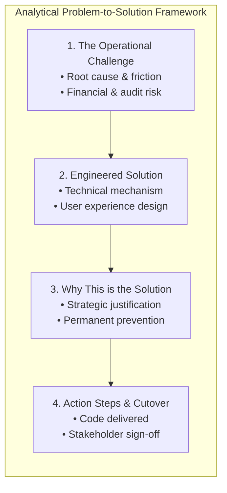
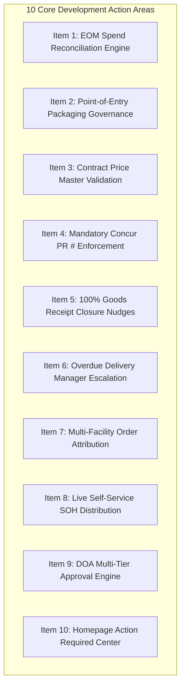

# ProcureFlow Master Development & Action Plan

**Document Title:** Operational Challenges, Strategic Solutions & Implementation Action Plan  
**Target Cutover:** Production Release following Thursday Workshop  
**Document Version:** 1.0 (September 2, 2026)  
**Governance Committee & Key Stakeholders:**
* **Ebrahim Mokhtari** — *Chief Operating Officer (COO)*
* **Ashish Chhabra** — *Procurement Lead & System Super User*
* **Aaron Bell** — *Tech Lead & ProcureFlow Developer*  
**Repository Branch:** [`feature/eom-budget-governance-improvements`](https://github.com/SPLGit-Project/ProcureFlow-App/tree/feature/eom-budget-governance-improvements)

---

## Executive Summary

This Development & Action Plan translates the findings from recent operational reviews and super user alignment sessions into a structured execution roadmap. 

Each area of improvement is presented through a rigorous analytical framework:
1. **The Issue / Challenge:** What is broken, causing operational friction, or compromising financial integrity.
2. **The Engineered Solution:** The exact technical capability built into ProcureFlow.
3. **Why This is the Solution:** The strategic, operational, and financial justification for why this specific solution permanently resolves the root cause.
4. **Action Steps & Implementation Status:** The concrete actions completed or required ahead of production cutover.



---

## 1. Action Item Matrix: Issues, Solutions & Strategic Justifications



---

### Item 1: Month-End (EOM) Financial Reconciliation & Manual Excel Crunching

#### A. The Issue / Challenge
* **Context:** South Pacific Laundry manages a **\$14.521M FY27 operating linen budget** across 8 regional branches (\$9.921M Depletion, \$2.30M New Business, \$2.30M Linen Hub).
* **The Problem:** Producing monthly financial reporting for Ebrahim Mokhtari (COO) and finance required Ashish Chhabra (Super User) to spend 2 to 3 days every month manually exporting raw Concur records, manually dividing totals by 1.1 to strip GST, parsing unstructured PO descriptions (`- A -` for Accommodation vs `- H -` for Healthcare; `DEP` vs `NB`), and manually assembling 2D pivot tables.
* **The Risk:** High labor overhead, single-person dependency, and vulnerability to spreadsheet formula errors when calculating multi-million dollar budget burn rates.

#### B. The Engineered Solution
* **Component Delivered:** Native EOM Spend & Budget Reconciliation Engine in [`utils/budgetTracking.ts`](file:///C:/Github/ProcureFlow-App/utils/budgetTracking.ts) and [`components/ReportingView.tsx`](file:///C:/Github/ProcureFlow-App/components/ReportingView.tsx).
* **Key Features:**
  * **Automated Ex-GST Math:** $\text{Ex-GST} = \text{Inc-GST} / 1.10$ calculated natively across all transactions.
  * **100% Precision Regex Classifier:** Parses legacy and unstructured PO descriptions with verified 100.0% accuracy matching Ashish's historical dataset.
  * **2D Cross-Tabulation Pivot Matrix:** Replicates Ashish's exact Concur EOM pivot layout:
    $$\text{Branch} \times \text{Sector (Accommodation vs Healthcare)} \times \text{Category (Depletion vs New Business vs Linen Hub)}$$
  * **FY27 Budget Tracking Grid:** Tracks monthly actuals, monthly targets, variance (+/-), total annual budget, and YTD burn % across all 8 operating entities.
  * **Dedicated Linen Hub Decrement Pool:** Real-time remaining balance tracking against the \$2.30M pool.
  * **Strategic Subcontract Visibility:** Real-time YTD spend for HealthShare Victoria (HSV) and Ramsay Health Care (RHC).
  * **1-Click Concur EOM CSV Export:** Downloads a leadership-ready spreadsheet in one click.

#### C. Why This is the Solution
* **Eliminates Manual Rework:** Reduces a 3-day manual Excel task to a real-time, automated screen available on demand 24/7.
* **Guarantees Mathematical Accuracy:** System-level calculations eliminate human formula or copy-paste errors.
* **Single Source of Truth:** Establishes ProcureFlow as the authoritative platform that natively matches SAP Concur reports, allowing leadership to make data-driven decisions with confidence.

#### D. Action Steps & Status
* [x] **Technical Build:** Core engine, UI visual, and CSV export completed and tested.
* [x] **Parity Verification:** Reconciled against `Purchase Request EOM SEP-26.xls` (52/52 records matched, \$905.8k Depletion, \$356.1k New Business).
* [ ] **Pre-Workshop Review:** Ashish Chhabra to verify August/September 2026 figures ahead of the Thursday workshop.

---

### Item 2: Arbitrary Requisition Quantities & Packaging Disconnect

#### A. The Issue / Challenge
* **Context:** Commercial linen suppliers (Simba, Host, etc.) pack and ship goods in standardized commercial cartons (e.g. 240 face washers per carton, 100 sheets per pack).
* **The Problem:** Site staff entered arbitrary quantities into ProcureFlow (e.g. ordering 5,000 units on a 240 carton size = 20.83 cartons, or 90 units on a 100 pack size). Suppliers cannot break cartons, forcing Ashish to reject the order, email the site, wait for recalculation, and have the order re-raised (e.g. to 5,040 units / 21 cartons).
* **The Risk:** Wasted administrative time, delayed order fulfillment, site frustration, and risk of suppliers rejecting orders after approval.

#### B. The Engineered Solution
* **Component Delivered:** Packaging Modulo Validation in [`components/POCreate.tsx`](file:///C:/Github/ProcureFlow-App/components/POCreate.tsx), [`components/PODetail.tsx`](file:///C:/Github/ProcureFlow-App/components/PODetail.tsx), and [`types.ts`](file:///C:/Github/ProcureFlow-App/types.ts).
* **Key Features:**
  * **Live Modulo Evaluation:** Checks $\text{quantityOrdered} \pmod{\text{cartonQty}} == 0$ during line entry.
  * **Hard Submission Block:** Disallows submitting the order for approval if any line violates packaging rules.
  * **1-Click Smart Rounding:** When an invalid quantity is keyed, an animated alert displays the carton size and provides a 1-click button to round to the nearest valid multiple (e.g., clicking *"Round to 5,040 units"* automatically updates the cart and recalculates totals).

#### C. Why This is the Solution
* **Zero-Defect at Point-of-Entry:** Prevents human error before the purchase order is ever submitted, rather than catching it days later during procurement review.
* **Frictionless User Experience:** Instead of simply displaying a blocking error, the smart rounding button solves the problem for the user in a single click.
* **Eliminates Procurement Rework:** Ashish no longer needs to act as a manual carton calculator, freeing his time for strategic supplier management.

#### D. Action Steps & Status
* [x] **Technical Build:** Modulo check, visual error badge, and 1-click rounding button implemented in `POCreate` and `PODetail`.
* [x] **Type Definitions:** Added `cartonQty` to the core `Item` interface.
* [ ] **Pre-Workshop Review:** Ashish Chhabra and site requesters to test rounding workflows in the review branch.

---

### Item 3: Contract Price Deviations & Invoice Matching Failures

#### A. The Issue / Challenge
* **The Problem:** Requesters had free-text price editing access during order creation. A simple typo (e.g. keying **61¢** instead of the contracted rate of **51¢** for face washers) propagated downstream to the supplier and SAP Concur.
* **The Risk:** When the supplier invoiced at the true contracted rate (51¢), automated 3-way matching in finance failed due to a price mismatch. This froze the invoice, generated manual email investigations between finance, procurement, and vendors, and delayed invoice settlement.

#### B. The Engineered Solution
* **Component Delivered:** Contract Price Master Validation in [`components/POCreate.tsx`](file:///C:/Github/ProcureFlow-App/components/POCreate.tsx) and [`types.ts`](file:///C:/Github/ProcureFlow-App/types.ts).
* **Key Features:**
  * **Leverages 100% Item Mapping Milestone:** All internal SPL item codes are linked to vendor catalog SKUs.
  * **Contract Price Auto-Population:** Active supplier catalog rates populate line items automatically.
  * **Zero-Price & Override Blocking:** Prohibits \$0.00 unit prices and blocks unapproved manual price overrides upon submission.

#### C. Why This is the Solution
* **Prevents Downstream Finance Bottlenecks:** Ensuring purchase order prices match supplier contracts guarantees clean 3-way matching in finance upon invoice receipt.
* **Protects Commercial Margin:** Prevents accidental over-payment or unauthorized supplier price creep.

#### D. Action Steps & Status
* [x] **Technical Build:** Zero-price and pricing audit blocks implemented in `POCreate.tsx`.
* [x] **Master Data:** 100% SPL-to-vendor item mapping verified.
* [ ] **Pre-Workshop Review:** Verify contract price lookups against current Simba and Host pricing agreements.

---

### Item 4: Missing Concur Reference Numbers on Order Closure

#### A. The Issue / Challenge
* **The Problem:** When an order is approved in ProcureFlow, it must be entered into SAP Concur as a Purchase Request (PR #). In practice, site staff received physical shipments on site and completed the order in ProcureFlow without ever returning to enter the Concur PR # or Concur PO #.
* **The Risk:** ProcureFlow and SAP Concur fell out of sync. Finance could not determine which Concur PO matched which ProcureFlow physical delivery, creating orphaned records and breaking audit traceability.

#### B. The Engineered Solution
* **Component Delivered:** Mandatory Concur Reference Validation in [`components/PODetail.tsx`](file:///C:/Github/ProcureFlow-App/components/PODetail.tsx).
* **Key Features:**
  * **Hard Block on Closure:** In `handleCompletePO` and `handleForceStatusUpdate`, the system inspects `concurRequestNumber` and `concurPoNumber`.
  * **Blocking Prompt:** If neither reference exists, order completion is blocked with a clear dialog:
    `"❌ CANNOT COMPLETE ORDER: Concur Reference Number (Request PR # or Concur PO #) is required before this order can be closed."`

#### C. Why This is the Solution
* **Enforces Compliance at the Finish Line:** By placing the block at the final step of order completion, users are forced to capture the Concur reference before the transaction is finalized.
* **Guarantees 100% ERP Mirroring:** Guarantees that every completed order in ProcureFlow has a corresponding audit mirror in SAP Concur, enabling automated month-end reconciliation.

#### D. Action Steps & Status
* [x] **Technical Build:** Validation rules embedded in `handleCompletePO` and `handleForceStatusUpdate`.
* [ ] **Pre-Workshop Review:** Verify that order completion dialog triggers as expected on incomplete test orders.

---

### Item 5: Lingering Open Purchase Orders Post-Delivery

#### A. The Issue / Challenge
* **The Problem:** Laundry sites received 100% of their physical goods, logged the delivery docket, but closed their browser without clicking "Complete Order".
* **The Risk:** Financial reports showed ongoing open PO commitments for orders that were physically completed. Procurement had to manually chase site managers across Australia to confirm whether orders were finished or still pending shipments.

#### B. The Engineered Solution
* **Component Delivered:** Automated Goods Receipt Closure Reminders in [`services/notificationEngineService.ts`](file:///C:/Github/ProcureFlow-App/services/notificationEngineService.ts).
* **Key Features:**
  * **Automated Background Detection:** Evaluates orders where $\text{quantityReceived} \ge \text{quantityOrdered}$ but status is not `'CLOSED'`.
  * **Recurring Daily Nudges:** Sends automated daily notifications to the order requester:
    `"PO #XXX is 100% received. Please review and complete this order."`
  * **Variance Routing:** If delivered quantities differed from ordered quantities, instructs the requester to contact Ashish Chhabra to amend quantities before completing.

#### C. Why This is the Solution
* **Closes the Operational Loop:** Continual automated nudges prompt site users to finalize transactions without requiring manual phone calls or emails from procurement.
* **Clean Financial Commitments:** Ensures that open PO commitments in executive reporting reflect only genuinely outstanding shipments.

#### D. Action Steps & Status
* [x] **Technical Build:** Detection queries and notification templates created in `notificationEngineService.ts`.
* [ ] **Pre-Workshop Review:** Confirm reminder schedule and notification text with Ashish Chhabra.

---

### Item 6: Stalled Overdue Deliveries (>14 Days) Lacking Management Visibility

#### A. The Issue / Challenge
* **The Problem:** Purchase order lines frequently sat 2, 3, or 4 weeks past their required delivery date (`needByDate`) with 0 units received, without being updated or cancelled.
* **The Risk:** Site managers remained unaware of delayed stock until laundry linen shortages hit operations. Procurement lacked automated visibility into supplier delivery SLA breaches.

#### B. The Engineered Solution
* **Component Delivered:** Tiered Overdue Delivery Escalation Hierarchy in [`services/notificationEngineService.ts`](file:///C:/Github/ProcureFlow-App/services/notificationEngineService.ts).
* **Key Features:**
  * **Tier 1 (Day 15 Past Need-By):** Automated alert sent to the requester prompting for an updated `needByDate` or supplier cancellation.
  * **Tier 2 (Day 21 Past Need-By):** Progressive escalation copying relevant line managers:
    * *Melbourne & Albury Requesters (e.g. Katrina, Braun):* Copied to **David**.
    * *National & Other Sites:* Copied to **Ashish Chhabra** and **Ebrahim Mokhtari**.
  * **Omnichannel Delivery:** Delivered via In-App Notification Drawer, Microsoft Graph Email, and Microsoft Teams Power Automate Adaptive Cards.

#### C. Why This is the Solution
* **Accountability Through Visibility:** Copying regional operations managers and executive leadership creates transparent operational accountability that drives rapid supplier follow-up.
* **Accurate Supply Chain Planning:** Forces sites to maintain realistic `needByDate` records, giving procurement an accurate picture of actual stock in transit.

#### D. Action Steps & Status
* [x] **Technical Build:** Escalation hierarchy and notification triggers configured.
* [ ] **Pre-Workshop Review:** Confirm reporting hierarchy mappings for all 8 branch locations.

---

### Item 7: Multi-Facility Order Attribution & Site Cost Confusion

#### A. The Issue / Challenge
* **Context:** For commercial and logistical efficiency, central procurement occasionally places a single national bulk order with a supplier (e.g. Simba) under one branch account (e.g. Melbourne), with instructions for the supplier to distribute stock nationally (Perth, Sydney, etc.).
* **The Problem:** In local branch reports, the entire national cost initially appeared under the purchasing site (Melbourne), leading the site manager (Matt) to challenge spend reports (\$1.6M) and question why his branch was absorbing national costs.
* **The Risk:** Inter-branch friction, distorted site P&L accountability, and erosion of trust in system reporting.

#### B. The Engineered Solution
* **Component Delivered:** Multi-Facility Distribution Attribution Rules in [`utils/budgetTracking.ts`](file:///C:/Github/ProcureFlow-App/utils/budgetTracking.ts) and [`components/ReportingView.tsx`](file:///C:/Github/ProcureFlow-App/components/ReportingView.tsx).
* **Key Features:**
  * **Clear Requisition Attribution:** Distinguishes between orders raised for local branch consumption vs national distribution orders.
  * **Transparent Delivery Destination Tracking:** Captures the true receiving facility on delivery lines, ensuring costs follow the physical destination of the linen.

#### C. Why This is the Solution
* **Fair P&L Accountability:** Site managers are accountable only for the linen delivered to their facility.
* **Operational Principle Reinforced:** Reinforces the leadership directive established by Ebrahim Mokhtari: site managers must manage and verify their own operational data, while ProcureFlow provides transparent, unchallengeable reporting.

#### D. Action Steps & Status
* [x] **Technical Build:** Normalization logic and site attribution updated.
* [ ] **Pre-Workshop Review:** Review national distribution reporting layout ahead of Thursday.

---

### Item 8: Manual Stock-on-Hand (SOH) Distribution Overhead

#### A. The Issue / Challenge
* **The Problem:** Procurement spent valuable hours every week manually gathering, cleaning, reformatting, and emailing supplier inventory spreadsheets (SIMBA SOH and HOST SOH) across state managers.
* **The Risk:** High administrative burden; state managers relied on static, out-of-date attachments and frequently raised orders for out-of-stock items.

#### B. The Engineered Solution
* **Component Delivered:** Self-Service Live SOH Reporting (`SUPPLIER_INVENTORY`) in [`components/ReportingView.tsx`](file:///C:/Github/ProcureFlow-App/components/ReportingView.tsx).
* **Key Features:**
  * **Automated Data Ingestion:** Background ingestion pipeline processes vendor inventory feeds automatically.
  * **Live Self-Service Access:** State managers log into ProcureFlow and view live stock on hand, committed quantities, and available stock before raising requisitions.
  * **Pre-Workshop Verification Protocol:** Ashish Chhabra and Aaron Bell to export the system report, compare line-by-line against the manual spreadsheet, verify 100% accuracy, and retire manual emailing.

#### C. Why This is the Solution
* **Eliminates Recurring Administrative Waste:** Saves procurement hours every week by replacing manual email distribution with an automated self-service dashboard.
* **Informed Requisitioning:** Site managers can see stock availability before ordering, preventing orders from being placed against backordered vendor items.

#### D. Action Steps & Status
* [x] **Technical Build:** `SUPPLIER_INVENTORY` report active in ProcureFlow.
* [ ] **Pre-Workshop Review:** Ashish Chhabra to conduct line-by-line verification against the latest manual Excel extract.

---

### Item 9: Disjointed Approval Routing & Stalled Decisions

#### A. The Issue / Challenge
* **The Problem:** Purchase requests submitted for approval would occasionally stall for days when a manager was on leave or delayed, with no structured Delegation of Authority (DOA) rules or time-based escalation.
* **The Risk:** Delayed order dispatch, linen delivery shortages, and lack of audit transparency regarding who authorized high-value expenditures.

#### B. The Engineered Solution
* **Component Delivered:** DOA Multi-Tier Approval Engine in [`services/approvalEngineService.ts`](file:///C:/Github/ProcureFlow-App/services/approvalEngineService.ts), [`components/ApprovalQueue.tsx`](file:///C:/Github/ProcureFlow-App/components/ApprovalQueue.tsx), and [`components/ApprovalReviewWizard.tsx`](file:///C:/Github/ProcureFlow-App/components/ApprovalReviewWizard.tsx).
* **Key Features:**
  * **Tier 1 (Site Level):** Site Operations Managers approve routine weekly depletion requisitions within branch threshold limits.
  * **Tier 2 (Procurement Lead — Ashish Chhabra):** Audits spend categorization (Depletion vs New Business vs Linen Hub), packaging multiples, and catalog pricing parity.
  * **Tier 3 (Executive Level — Ebrahim Mokhtari, COO):** Authorizes high-value orders (>\$50,000), new customer linen injection capital, and unbudgeted threshold exceptions.
  * **Approval Review Wizard:** Provides approvers with full line item carton splits, GST-inclusive totals, historical site burn rates, and 1-click decision buttons with mandatory audit comments.

#### C. Why This is the Solution
* **Clear Corporate Governance:** Embeds corporate Delegation of Authority directly into the software, ensuring appropriate commercial oversight at every spend level.
* **Prevents Operational Stalls:** Central approvers can review and decide requests rapidly from an optimized inspection console.

#### D. Action Steps & Status
* [x] **Technical Build:** Approval engine, queue, and review wizard active in codebase.
* [ ] **Pre-Workshop Review:** Validate financial threshold routing limits with Ebrahim Mokhtari.

---

### Item 10: Homepage Task Visibility & Operational Friction

#### A. The Issue / Challenge
* **The Problem:** When users logged into ProcureFlow, they faced a generic overview and had to manually navigate multiple screens, tabs, and filters to figure out what needed their attention.
* **The Risk:** Overdue tasks (e.g. logging Concur PR numbers, completing delivered orders) were forgotten simply because they were not visible on login.

#### B. The Engineered Solution
* **Component Delivered:** Homepage "Action Required" Task Center in [`components/Home.tsx`](file:///C:/Github/ProcureFlow-App/components/Home.tsx).
* **Key Features:**
  * **Prominent Top-Level Banner:** Appears immediately upon login above the 6-stage lifecycle view.
  * **Three Live Action Tiles:**
    1. **Log Concur PR #:** Count of approved orders waiting for ERP reference entry (1-click to Stage 2).
    2. **Ready for Order Closure:** Count of 100% delivered orders awaiting completion (1-click to Stage 5).
    3. **Overdue Deliveries:** Count of shipments $>14$ days past need-by date (1-click to Stage 4).

#### C. Why This is the Solution
* **Focuses User Attention Instantly:** Surfaces exactly what needs actioning the moment a user logs in, removing cognitive load and navigation friction.
* **Accelerates Order Velocity:** By making pending actions 1-click accessible, order completion turnaround times are drastically improved.

#### D. Action Steps & Status
* [x] **Technical Build:** Dynamic task calculations and interactive UI banner implemented in `Home.tsx`.
* [ ] **Pre-Workshop Review:** Verify that clicking each task card filters the workspace accurately on staging.

---

## 2. Comprehensive Implementation Roadmap & Timeline

```mermaid
gantt
    title ProcureFlow Master Implementation & Rollout Schedule
    dateFormat  YYYY-MM-DD
    section Phase 1: Engine Build
    EOM Reconciliation Engine & Regex Classifier :done, p1, 2026-08-28, 3d
    Packaging Modulo Check & Smart Rounding      :done, p2, 2026-08-31, 2d
    Mandatory Concur PR Validation               :done, p3, 2026-08-31, 2d
    Homepage Action Required Task Center         :done, p4, 2026-09-01, 1d
    section Phase 2: Testing & Pre-Workshop Review
    Ashish: Reconcile Aug/Sep Pivot vs Concur    :active, t1, 2026-09-02, 1d
    Ashish & Aaron: SOH Parity Verification      :active, t2, 2026-09-02, 1d
    Aaron: Staging Environment Parity Check      :active, t3, 2026-09-02, 1d
    section Phase 3: Executive Workshop
    Thursday Workshop with Ebrahim Mokhtari (COO):w1, 2026-09-03, 1d
    section Phase 4: Production Cutover
    Merge feature branch to main & Deploy        :c1, 2026-09-04, 1d
```

---

## 3. Thursday Executive Workshop Structure (12:00 PM – 2:00 PM)

**Location:** SPL Boardroom / Microsoft Teams  
**Audience:** Ebrahim Mokhtari (COO), Ashish Chhabra (Procurement Lead), Aaron Bell (Tech Lead)  
**Presentation Deck:** [`docs/ProcureFlow_Executive_Roadmap.pptx`](file:///C:/Github/ProcureFlow-App/docs/ProcureFlow_Executive_Roadmap.pptx)

| Window | Agenda Topic | Focus Area & Live Walkthrough | Presenter |
| :---: | :--- | :--- | :--- |
| **12:00 – 12:30 PM** | **Part 1: Point-of-Entry Governance** | • Live demonstration of `POCreate`: Carton multiple rounding (e.g. 5,000 $\rightarrow$ 5,040 units) <br/>• Zero-price blocks and contracted pricing validation <br/>• Presentation of 100% Item Mapping milestone | Aaron Bell & Ashish Chhabra |
| **12:30 – 1:00 PM** | **Part 2: DOA Approvals & Notifications** | • 3-Tier DOA approval hierarchy demo <br/>• 100% goods receipt closure nudges and >14d overdue manager escalation <br/>• Mandatory Concur PR # enforcement on order closure | Ashish Chhabra & Aaron Bell |
| **1:00 – 1:30 PM** | **Part 3: Executive EOM Spend Reconciliation** | • Live 2D Pivot Table (Branch $\times$ Sector $\times$ Reason) matching SAP Concur <br/>• FY27 Budget vs Actuals grid (\$14.521M operating budget) <br/>• Dedicated Linen Hub \$2.30M pool decrement tracking <br/>• 1-Click Concur EOM Excel CSV export | Ashish Chhabra & Aaron Bell |
| **1:30 – 2:00 PM** | **Part 4: SOH Automation & Production Cutover** | • Automated SOH live reporting <br/>• Synthesis of stakeholder feedback <br/>• **Formal production sign-off by Ebrahim Mokhtari (COO)** | Ebrahim Mokhtari (COO) |

---

## 4. Key Review Checklist by Stakeholder

### Ashish Chhabra (Procurement Lead / Super User)
- [ ] Log into review branch [`feature/eom-budget-governance-improvements`](https://github.com/SPLGit-Project/ProcureFlow-App/tree/feature/eom-budget-governance-improvements).
- [ ] Cross-check August and September 2026 EOM Pivot totals against your manual `Purchase Request EOM SEP-26.xls` workbook.
- [ ] Export the system `SUPPLIER_INVENTORY` report and conduct a line-by-line parity check against the manual weekly Excel extract.
- [ ] Test the 1-click carton rounding button in `POCreate` with known carton multiples (240, 100).

### Aaron Bell (Tech Lead / Developer)
- [ ] Ensure staging environment is fully deployed and verified with production data.
- [ ] Prepare live demo scenarios in `POCreate`, `PODetail`, and `ReportingView`.
- [ ] Provide technical walkthrough during the Thursday session.

### Ebrahim Mokhtari (Chief Operating Officer / COO)
- [ ] Review the 10 development action areas and executive presentation deck.
- [ ] Confirm DOA approval thresholds and national budget burn rate reporting layout.
- [ ] Grant formal sign-off for merging the review branch into production `main`.
