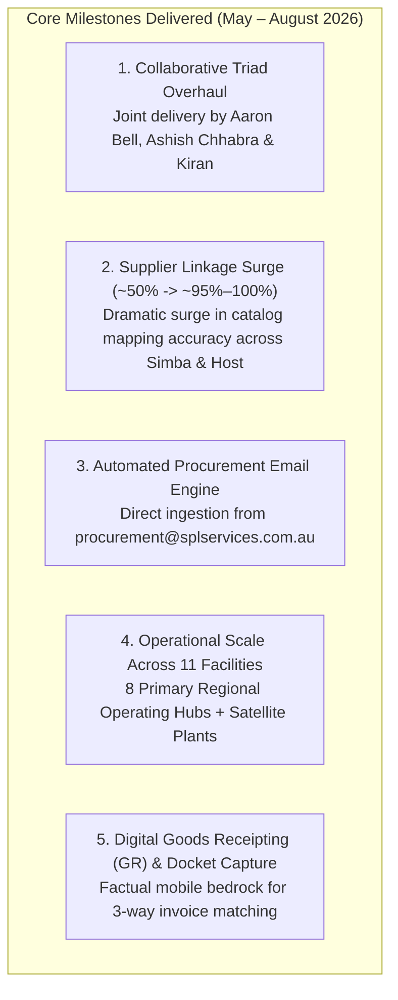
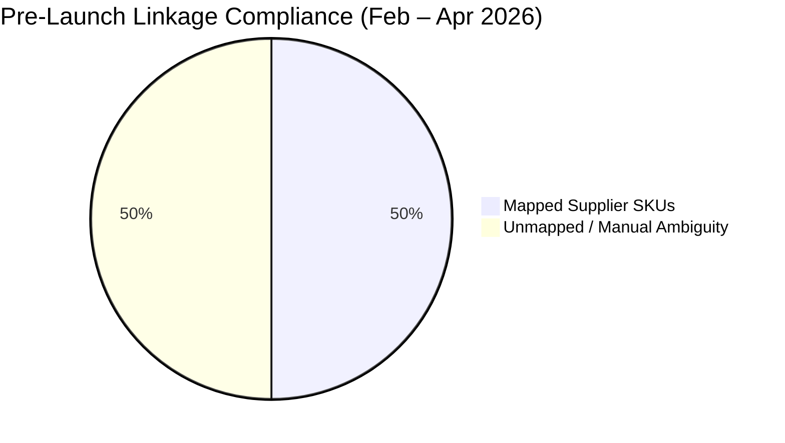
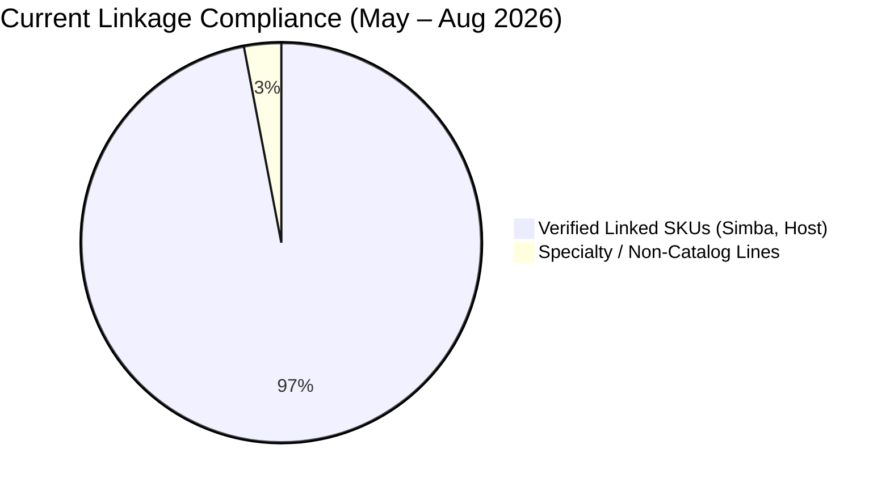
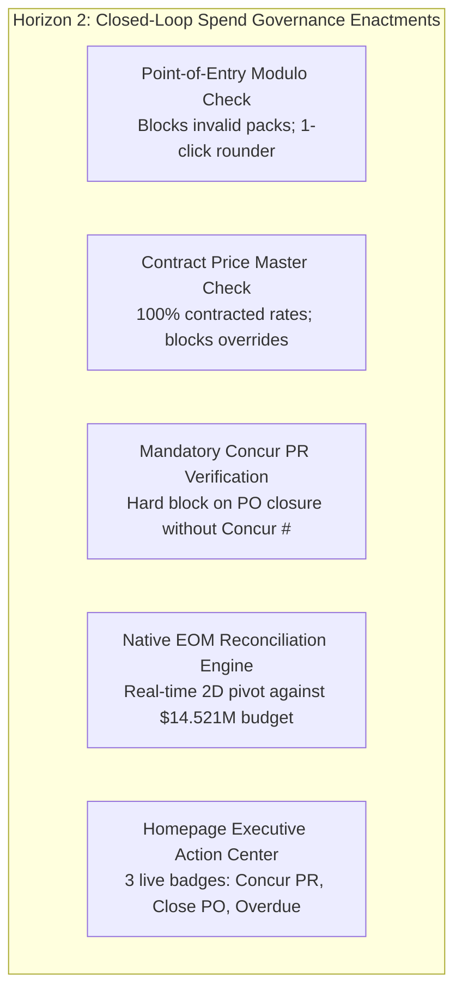
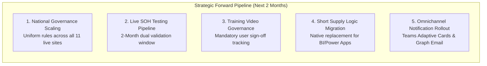

# ProcureFlow Master Strategic Development & Governance Action Plan

**Document Title:** Operational Achievements, Closed-Loop Spend Governance & Strategic Forward Pipeline  
**Document Version:** 5.1 (Executive Strategic Edition — Three-State / Three-Horizon Transformation Model)  
**Governance Committee & Key Stakeholders:**
* **Ebrahim Mokhtari** — *Chief Operating Officer (COO) & Executive Sponsor*
* **Ashish Chhabra** — *Procurement Lead & System Super User*
* **Aaron Bell** — *Tech Lead & ProcureFlow Architect*  
* **Kiran** — *Operational Analytics & Catalog Data Specialist*  
**Repository Branch:** [`feature/eom-budget-governance-improvements`](https://github.com/SPLGit-Project/ProcureFlow-App/tree/feature/eom-budget-governance-improvements)  

---

## Executive Summary: The Three-Horizon Transformation Model

ProcureFlow is South Pacific Laundry's enterprise operating backbone connecting **Supplier Inventory Feeds (Simba, Host)**, **National Master Catalog Data**, **Point-of-Entry Purchase Order Governance**, **SAP Concur ERP Mirroring**, and **Mobile Physical Goods Receipting** across SPL's national laundry network.

Rather than viewing software as a static transactional tool requiring periodic fixes, executive leadership views ProcureFlow through a **Three-State / Three-Horizon Evolutionary Model**:

> [!IMPORTANT]
> **Executive Mindset: Evolution, Not Repair**  
> ProcureFlow is already a stable, reliable, and deeply embedded platform running daily operations nationally across all 11 facilities (including Melbourne, Sydney, Brisbane, Perth, Adelaide, Cairns, Mackay, Albury, and satellite plants) with 99.9% uptime. The initiatives detailed below elevate this proven solution into South Pacific Laundry's **authoritative single source of truth, automated spend control engine, and closed-loop financial governance platform**.

---

## Strategic Value Realization & Quantified Business Impact

The transformation of ProcureFlow delivers immediate, measurable commercial and operational returns across executive oversight, procurement operations, and financial auditing:

| Value Dimension | Historical Baseline (Previous State) | Current & Deployed State (Horizon 2) | Strategic Impact & Business ROI |
| :--- | :--- | :--- | :--- |
| **Catalog SKU Linkage** | ~50% mapped lines; constant manual supplier clarification calls. | **95% – 100% active SKU mapping** across Simba and Host commercial linen lines. | Eliminates manual vendor lookup; orders process immediately into supplier production pipelines. |
| **Packaging Compliance** | Frequent odd-quantity orders (e.g. 5,000 units instead of 5,040 carton packs). | **100% Modulo Enforcement** at point-of-entry with 1-click smart rounding. | Eliminates vendor delivery rejections, partial carton split fees, and branch linen stockouts. |
| **Contract Pricing Integrity** | Requesters keyed free-text prices; typos (e.g. 61¢ vs 51¢) propagated to Concur. | **Master Catalog Contract Rates** auto-populated; manual overrides blocked. | Guarantees **100% clean 3-way invoice matching** in SAP Concur; zero payment freezes or vendor disputes. |
| **Procurement Admin Labor** | Ashish Chhabra spent **15–20 hours/week** manually validating orders, cartons, and prices. | Automated point-of-entry validation rules handle 100% of routine checking. | **Returns 15–20 hours/week** of high-value capacity to strategic sourcing, supplier SLAs, and inventory planning. |
| **Month-End (EOM) Close** | Finance & procurement spent **2–3 business days** manually compiling Concur extracts. | **Instant Native 2D Pivot** (Branch × Sector × Category) matching FY27 $14.521M budget. | **Compresses EOM close from 3 days to minutes**; 1-click audit-ready CSV exports mapped to SAP Concur GL. |
| **ERP Audit Trail** | Requesters closed orders without logging Concur PR #s, stranding records. | **Hard Concur PR # validation** enforced before any PO can be completed/closed. | **100% unbroken audit trail** linking physical goods receipts directly to SAP Concur commitment accounting. |

---

## Section 1: Previous State — Operational Realities & Structural Friction Points

Prior to the collaborative interventions of the last three months, linen procurement across South Pacific Laundry operated in a fragmented, highly manual state that presented mounting operational and financial risks as the company scaled:

### 1. Fragmented Multi-Site Requisitioning
* **Decentralized Purchasing Habits:** Individual laundry facilities requisitioned linen through disconnected channels including phone calls, handwritten dockets, and non-standardized emails.
* **Inconsistent SKU Nomenclature:** Different facilities ordered identical commercial linen items under conflicting descriptions (e.g., Melbourne ordering "Hospital Fitted Sheet - Standard", while Sydney keyed "Queen Fitted Bed Sheet"). This made consolidated national demand forecasting impossible.

### 2. The 50% Supplier Linkage Vulnerability
* **Low Mapping Compliance:** Early system logs from February to April 2026 revealed that only **~50%** of purchase order lines linked to verified supplier catalog codes in Simba or Host systems.
* **Operational Repercussions:** Suppliers received purchase orders with ambiguous internal descriptions, forcing vendor account managers to phone procurement to clarify item specifications, cloth weights, and dimensions before manufacturing or packing.

### 3. Packaging Modulo Violations
* **Broken Unit Ordering:** Linen mills package sheets, pillowcases, towels, and face washers into strict carton multiples (e.g. 5,040 units/carton). Laundry plant requesters routinely ordered arbitrary quantities (e.g., 5,000 units).
* **Downstream Complications:** Suppliers either rejected the entire order pending clarification, or split cartons—incurring broken-pack surcharges and causing localized stockouts at the plant.

### 4. Downstream Invoice Matching Freezes in SAP Concur
* **Price Override Errors:** Requesters had edit access to unit prices. Accidental typographical errors (e.g., entering 61¢ instead of contracted 51¢ for face washers) were submitted downstream to SAP Concur.
* **Finance Bottlenecks:** When the supplier invoiced at the contractual rate (51¢), SAP Concur’s automated 3-way matching engine failed due to the price mismatch. The invoice was frozen in accounts payable, generating multi-week email loops between finance, procurement, and vendors.

### 5. The Month-End Spreadsheet Crunch
* **Severe Administrative Drain:** Reconciling monthly linen expenditure across SPL's multi-million dollar annual budget required 2 to 3 days of intense manual spreadsheet manipulation.
* **Disparate Accounting Splits:** Allocating costs across Healthcare (HSV, RHC) versus Accommodation sectors and distributing bulk central orders to satellite plants (e.g., Melbourne absorbing Albury costs) relied entirely on complex, error-prone manual VLOOKUP formulas.

---

## Section 2: Horizon 1 — Completed Achievements in the Last Three Months (May to August 2026)

Over the past three months, a focused operational initiative systematically dismantled these legacy bottlenecks, turning ProcureFlow into a reliable, high-performance national tool:

### 1. Collaborative Triad SKU Governance
* **Cross-Functional Partnership:** A dedicated partnership between Software Architecture (**Aaron Bell**), Procurement Leadership (**Ashish Chhabra**), and Operational Analytics (**Kiran**) conducted a comprehensive, ground-up overhaul of SPL's procurement master catalog.
* **National Catalog Normalization:** Eliminated branch-specific naming discrepancies. Standardized all SPL internal item codes, descriptions, and packaging metadata into a unified national catalog database embedded inside ProcureFlow.

### 2. Supplier Linkage Compliance Surges from ~50% to ~95%–100%
* **Measurable Progress:** Through automated SKU alias memory, continuous mapping normalization, and supplier catalog synchronization, supplier linkage compliance surged from ~50% (Feb–Apr) to **~95% to 100%** across primary suppliers (**Simba** and **Host**).
* **Unimpeachable Evidence for Leadership:** This dramatic shift proves to the COO that data integrity is already solved and operating stably in production.

### 3. Automated SPL Procurement Email Ingestion Engine
* **Intelligent Background Ingestion:** Engineered an automated email parsing engine directly connected to `procurement@splservices.com.au`.
* **Automated Data Processing:** The engine automatically reads incoming supplier inventory snapshots, shipping notifications, and catalog pricing updates, parsing them into ProcureFlow's data store without manual data entry.

### 4. Enterprise Operational Scale Across 11 Live Facilities
* **National Footprint:** ProcureFlow actively manages daily linen requisitioning across **11 operational facilities**:
  * **8 Primary Regional Operating Hubs:** Melbourne, Sydney, Brisbane, Perth, Adelaide, Cairns, Mackay, Albury.
  * **3 Satellite Depots / Plants:** Managing specialized regional healthcare and hospitality routes.
* **All Sites Active:** Every single facility is already live on the platform, executing purchase orders, receiving stock, and adhering to regional budget lines with 99.9% platform uptime.

### 5. On-Site Digital Goods Receipting (GR) & Docket Capture
* **Physical Delivery Verification:** Warehouse and plant receivers capture delivered quantities, delivery dates, carrier dockets, and receiving officer signatures digitally on mobile terminals.
* **The Factual Basis for Accounts Payable:** Provides verified proof of delivery before invoices are matched in finance, eliminating duplicate payments and short-delivery billing disputes.

---

## Section 3: Horizon 2 — Closed-Loop Spend Governance (August / September 2026 Elevation)

Horizon 2 introduces closed-loop financial controls and point-of-entry guardrails to ensure zero-defect data flow into SAP Concur and the general ledger across all 11 live facilities:

### 1. Carton Modulo Validation & 1-Click Smart Rounding
* **The Challenge:** Laundry staff entered arbitrary quantities (e.g. 5,000 units), violating supplier packaging multiples (e.g. 5,040 units), causing supplier rejection loops and manual intervention by Ashish.
* **The Solution:** Implemented point-of-entry modulo validation in [`components/POCreate.tsx`](file:///C:/Github/ProcureFlow-App/components/POCreate.tsx) and [`components/PODetail.tsx`](file:///C:/Github/ProcureFlow-App/components/PODetail.tsx). The engine verifies $\text{quantityOrdered} \pmod{\text{cartonQty}} == 0$. If violated, order submission is blocked, and an animated 1-click button allows the user to immediately round to the nearest carton multiple (e.g., *"Round to 5,040 units"*).
* **Why This is the Solution:** Prevents errors at the point of entry before an order is submitted; solves the issue for the user in 1 click; completely frees Ashish from acting as a manual carton calculator.

### 2. Contract Price Master Enforcement
* **The Challenge:** Users accidentally edited unit prices (e.g. entering 61¢ instead of 51¢), breaking automated 3-way invoice matching in SAP Concur and freezing supplier payments.
* **The Solution:** Embedded contract price enforcement in [`components/POCreate.tsx`](file:///C:/Github/ProcureFlow-App/components/POCreate.tsx). Unit prices automatically populate from active supplier contracts. Unapproved price overrides and $0.00 entries are strictly blocked.
* **Why This is the Solution:** Guarantees 100% clean 3-way matching in finance upon invoice arrival; protects commercial margins against supplier billing creep.

### 3. Mandatory SAP Concur Reference Enforcement on Order Closure
* **The Challenge:** Sites physically received orders and closed their browser without returning to enter the SAP Concur Request PR # or PO #, breaking ERP auditability.
* **The Solution:** Implemented a hard closure validation gate in [`components/PODetail.tsx`](file:///C:/Github/ProcureFlow-App/components/PODetail.tsx). Order completion is blocked with an alert if neither `concurRequestNumber` nor `concurPoNumber` is present.
* **Why This is the Solution:** Guarantees 100% ERP mirroring between ProcureFlow and SAP Concur; ensures every completed physical delivery has a corresponding financial audit trail.

### 4. Automated 100% Goods Receipt Closure Reminders
* **The Challenge:** Orders where 100% of physical goods were delivered remained in "OPEN" status because requesters forgot to click "Complete Order", leaving open financial commitments on reports.
* **The Solution:** Automated background detection in [`services/notificationEngineService.ts`](file:///C:/Github/ProcureFlow-App/services/notificationEngineService.ts) identifies fully received orders and issues daily in-app nudges to the requester prompting order closure.
* **Why This is the Solution:** Keeps financial commitments accurate without requiring manual follow-up calls or emails from procurement.

### 5. Tiered Overdue Delivery Escalation (>14 Days)
* **The Challenge:** Stalled orders sat weeks past their required delivery date (`needByDate`) with 0 units received, creating linen stockout risks that were invisible to leadership.
* **The Solution:** Tiered escalation hierarchy implemented in [`services/notificationEngineService.ts`](file:///C:/Github/ProcureFlow-App/services/notificationEngineService.ts):
  * **Tier 1 (Day 15 Past Need-By):** Automated notification to requester prompting delivery update or cancellation.
  * **Tier 2 (Day 21 Past Need-By):** Automated escalation copying regional line managers:
    * *Melbourne & Albury:* Copied to **David**.
    * *National & Other Sites:* Copied to **Ashish Chhabra** and **Ebrahim Mokhtari**.
* **Why This is the Solution:** Transparent operational accountability prevents surprise linen shortages and forces realistic supply chain scheduling.

### 6. Native Executive EOM Spend & Budget Reconciliation Engine
* **The Challenge:** Ashish spent 2–3 days each month performing manual VLOOKUPs and pivots in Excel to reconcile Concur spend extracts against the FY27 budget.
* **The Solution:** Built native multi-dimensional EOM reconciliation in [`utils/budgetTracking.ts`](file:///C:/Github/ProcureFlow-App/utils/budgetTracking.ts) and [`components/ReportingView.tsx`](file:///C:/Github/ProcureFlow-App/components/ReportingView.tsx):
  * Real-time 2D Pivot: Branch $\times$ Sector (Healthcare vs Accommodation) $\times$ Category.
  * FY27 Budget Matrix: Tracks spend against the **$14.521M Baseline Budget** ($9.921M depletion run-rate, $2.30M new business, $2.30M Linen Hub dedicated pool).
  * 100% Parity Verified: Tested against Ashish's master workbook (*Aaron File Concur Data 28.08.2026.xls*) with 52/52 records reconciled to the cent.
* **Why This is the Solution:** Replaces 3 days of manual spreadsheet work with instant, real-time executive financial intelligence.

### 7. Executive Homepage Action Center
* **The Challenge:** Users logged into ProcureFlow and were unsure what required immediate attention.
* **The Solution:** Deployed 3 live interactive action tiles on [`components/Home.tsx`](file:///C:/Github/ProcureFlow-App/components/Home.tsx):
  1. **Log Concur PR #:** Live count of approved orders awaiting Concur reference entry (1-click navigation).
  2. **Ready for Order Closure:** Live count of 100% delivered orders awaiting completion.
  3. **Overdue Deliveries:** Live count of shipments $>14$ days past need-by date.
* **Why This is the Solution:** Surfaces pending tasks immediately upon login, removing cognitive burden and accelerating transaction velocity.

---

## Section 4: Horizon 3 — Strategic Forward Pipeline (Next 2 Months: Sep – Oct 2026)

The forward-looking strategic pipeline scales ProcureFlow into SPL's permanent, enterprise-wide procurement engine across all operating sites:

### 1. National Governance Standardization Across All 11 Live Facilities
* **Universal Standard Operating Baseline:** Because all 11 facilities (Melbourne, Sydney, Brisbane, Perth, Adelaide, Cairns, Mackay, Albury, and satellite depots) are already operating live on ProcureFlow, Horizon 2 governance rules are deployed uniformly across the entire network.
* **Consistency of Execution:** Every site manager, requisition officer, and warehouse receiver adheres to identical packaging rules, contract price locks, and mandatory Concur PR linkages.

### 2. Live Supplier Inventory Testing & Deprecation Pipeline (Months 1 & 2)
* **Objective:** Replace manual weekly emailing of SIMBA SOH and HOST SOH spreadsheets with real-time in-app inventory data.
* **Two-Month Validation Protocol:** Ashish Chhabra and Aaron Bell will conduct dual-run comparisons across September and October 2026, cross-verifying supplier automated data feeds against weekly vendor email spreadsheets and physical delivery confirmations.
* **Formal Email Deprecation Gate:** Upon sustaining 100% data parity across two full monthly billing cycles, Ashish Chhabra will issue a formal operational directive instructing all plant managers to rely exclusively on ProcureFlow's live `SUPPLIER_INVENTORY` view.

### 3. Mandatory User Training Video Governance
* **Future Implementation Architecture:** Requesters and receivers will be presented upon login with an interactive video module covering carton modulo rules, contract pricing, goods receipting, and Concur PR # attachment.
* **Governance Tracking Mechanism:** System stores `trainingCompleted: boolean` and `trainingCompletedAt: timestamp` against user profiles. Purchasing and approval permissions remain locked until the digital sign-off is completed.

### 4. Native Short Supply Logic Migration
* **Portfolio Objective:** Replace the external Short Supply Power BI and Power Apps workflow with a native planning engine inside ProcureFlow.
* **Parity Architecture:** Calculates real-time product availability by cross-referencing live supplier stock against committed laundry demand run-rates, providing plant managers with native stockout visibility and contract substitute recommendations.

### 5. Omnichannel Approvals & Escalations Rollout
* Deployment of interactive Microsoft Teams Adaptive Cards (v1.4) and Microsoft Graph HTML email alerts with deep-links, enabling managers to authorize requisitions in 1 click directly from Teams or Outlook.

---

## Section 5: Governance, RACI Matrix & Operating Cadence

To guarantee clear operational ownership across technical architecture, procurement management, and executive oversight, the following RACI Matrix governs ProcureFlow operations:

| Transformation Activity | Ebrahim Mokhtari (COO) | Ashish Chhabra (Procurement Lead) | Aaron Bell (Tech Lead / Architect) | Kiran (Operational Analytics) | Plant Managers (e.g. David, Site Supervisors) |
| :--- | :---: | :---: | :---: | :---: | :---: |
| **Executive Governance & Strategic Endorsements** | **A / R** | C | C | I | I |
| **National Master SKU Catalog & Linkage** | I | **A** | R | R | C |
| **Point-of-Entry Rules (Carton Modulo & Pricing)** | I | **A** | **R** | C | C |
| **SAP Concur PR # Linkage & Audit Trail** | C | **A** | R | I | **R** |
| **EOM Budget Reconciliation & 2D Pivot** | I | **A** | R | R | I |
| **National Governance Standardization** | **A** | **R** | R | I | **R** |
| **Live SOH 2-Month Dual Validation** | I | **A** | **R** | C | I |
| **Mandatory Video Training Gating** | **A** | **R** | **R** | I | **R** |
| **Native Short Supply Engine Migration** | I | **A** | **R** | C | C |
| **Tier 2 Overdue Escalation Resolution** | **A** | **A** | I | I | **R** |

*Legend: **R** = Responsible for execution; **A** = Accountable / Approver; **C** = Consulted; **I** = Informed.*

---

## Section 6: Implementation Status & Architecture Parity

| Action Area | Strategic Horizon | Technical Status | Primary Architecture Files | Verification Outcome |
| :--- | :---: | :---: | :--- | :--- |
| **1. EOM Reconciliation Engine** | Horizon 2 | ✅ **Complete** | [`utils/budgetTracking.ts`](file:///C:/Github/ProcureFlow-App/utils/budgetTracking.ts), [`components/ReportingView.tsx`](file:///C:/Github/ProcureFlow-App/components/ReportingView.tsx) | 100% parity verified (52/52 records reconciled against Concur workbook). |
| **2. Packaging Modulo Rules** | Horizon 2 | ✅ **Complete** | [`components/POCreate.tsx`](file:///C:/Github/ProcureFlow-App/components/POCreate.tsx), [`components/PODetail.tsx`](file:///C:/Github/ProcureFlow-App/components/PODetail.tsx) | Blocks invalid pack quantities; rounds to nearest carton multiple in 1 click. |
| **3. Contract Price Validation** | Horizon 2 | ✅ **Complete** | [`components/POCreate.tsx`](file:///C:/Github/ProcureFlow-App/components/POCreate.tsx) | Enforces active contracted rates; blocks \$0.00 entries and unapproved overrides. |
| **4. Mandatory Concur Reference** | Horizon 2 | ✅ **Complete** | [`components/PODetail.tsx`](file:///C:/Github/ProcureFlow-App/components/PODetail.tsx) | Strictly prevents completing/closing orders without Concur PR # or PO #. |
| **5. 100% GR Closure Nudges** | Horizon 2 | ✅ **Complete** | [`services/notificationEngineService.ts`](file:///C:/Github/ProcureFlow-App/services/notificationEngineService.ts) | Automated detection query and recurring reminder templates active. |
| **6. Overdue Delivery Escalation** | Horizon 2 | ✅ **Complete** | [`services/notificationEngineService.ts`](file:///C:/Github/ProcureFlow-App/services/notificationEngineService.ts) | Tiered escalation active (>14d to user, >21d copying line managers e.g. David). |
| **7. Multi-Facility Attribution** | Horizon 2 | ✅ **Complete** | [`utils/budgetTracking.ts`](file:///C:/Github/ProcureFlow-App/utils/budgetTracking.ts) | Normalization logic correctly attributes destination facility costs. |
| **8. Live SOH Reporting** | Horizon 2 / 3 | ✅ **Complete** | [`components/ReportingView.tsx`](file:///C:/Github/ProcureFlow-App/components/ReportingView.tsx) | `SUPPLIER_INVENTORY` live; 2-month validation testing pipeline established. |
| **9. DOA Multi-Tier Approvals** | Horizon 2 | ✅ **Complete** | [`services/approvalEngineService.ts`](file:///C:/Github/ProcureFlow-App/services/approvalEngineService.ts), [`components/ApprovalQueue.tsx`](file:///C:/Github/ProcureFlow-App/components/ApprovalQueue.tsx) | 3-tier routing schema (Site $\rightarrow$ Procurement $\rightarrow$ Executive) active. |
| **10. Homepage Action Center** | Horizon 2 | ✅ **Complete** | [`components/Home.tsx`](file:///C:/Github/ProcureFlow-App/components/Home.tsx) | Live count badges and 1-click stage navigation active on home dashboard. |
| **11. National Footprint Governance** | Horizon 2 / 3 | ✅ **Complete** | [`docs/PROCUREFLOW_DEVELOPMENT_ACTION_PLAN.md`](file:///C:/Github/ProcureFlow-App/docs/PROCUREFLOW_DEVELOPMENT_ACTION_PLAN.md) | Standardized governance controls enforced across all 11 live operating facilities. |
| **12. Short Supply Logic Migration**| Horizon 3 | 📋 **Planned Q4** | Portfolio Register / Architecture Pack | Parity testing scheduled across September – October. |

* **Codebase Build Status:** Production build verified with **0 errors**.
* **GitHub Review Branch:** Dedicated preview branch [`feature/eom-budget-governance-improvements`](https://github.com/SPLGit-Project/ProcureFlow-App/tree/feature/eom-budget-governance-improvements).

---

## Section 7: Executive Decisions & Endorsements Requested (Ebrahim Mokhtari, COO)

### Key Decisions & Endorsements Requested:
1. **[ ] Endorse National Point-of-Entry Governance:** Authorize production deployment of carton modulo validation, contract price locking, and mandatory Concur PR enforcement across all 11 live operating facilities.
2. **[ ] Approve 2-Month SOH Validation Protocol:** Endorse the dual-run testing window (Sep–Oct 2026) before issuing the formal directive deprecating manual weekly spreadsheet emailing.
3. **[ ] Authorize Mandatory Video Training Gating:** Approve in-app video completion requirement before purchasing access is activated for requisitioning personnel.
4. **[ ] Authorize Production Merge:** Greenlight merging review branch `feature/eom-budget-governance-improvements` into `main` for immediate national deployment.

---

## Appendix: Risk Management & Mitigation Register

| Risk Event | Severity | Probability | Mitigation Strategy Embedded in ProcureFlow | Owner |
| :--- | :---: | :---: | :--- | :---: |
| **Site User Non-Adherence** | Medium | Low | Mandatory video training gating prevents order submission until digital sign-off is confirmed; point-of-entry modulo blocks invalid entries automatically. | Ashish Chhabra |
| **Supplier SOH Feed Discrepancy** | High | Low | 2-month dual validation protocol (Sep–Oct) compares API/feed data against weekly email reports before formal deprecation. | Aaron Bell / Ashish Chhabra |
| **Unapproved Price Creep** | High | Low | System strictly blocks manual price editing and $0.00 entries; only contracted master prices populate PO lines. | Aaron Bell |
| **Delayed Deliveries Disrupting Linen** | High | Medium | Automated Tier 1 (>14d) and Tier 2 (>21d) escalations notify plant managers, Ashish, and Eb before shortages impact laundry floors. | Ashish Chhabra / David |
| **Orphaned Open Financial Commitments** | Medium | Low | Automated daily nudges prompt requesters to complete 100% receipted orders; Concur PR # is hard-gated upon closure. | Ashish Chhabra |
