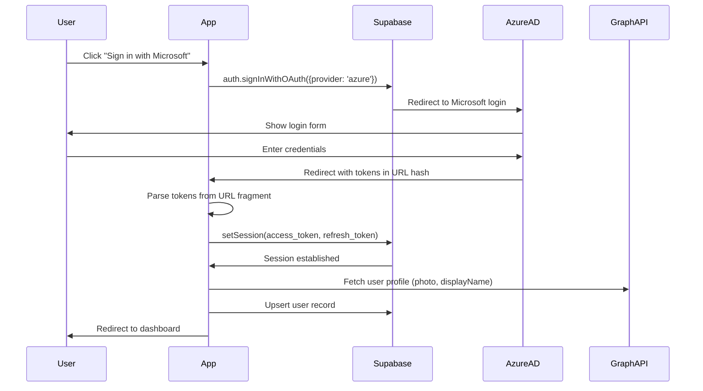

# AUTH MODULE: Supabase + Azure Entra ID (CURRENT)

> **Module Type**: Authentication
> **Provider**: Supabase Auth with Azure (Microsoft) OAuth
> **Status**: CURRENT PRODUCTION

---

## Module Interface Contract

### Inputs (Operator-Provided)

| Input | Source | Required |
|-------|--------|----------|
| Supabase Project URL | Supabase Dashboard → Settings → API | YES |
| Supabase Anon Key | Supabase Dashboard → Settings → API | YES |
| Azure Entra Client ID | Azure Portal → App registrations | YES |
| Azure Entra Client Secret | Azure Portal → Certificates & secrets | YES |
| Azure Entra Tenant ID | Azure Portal → Entra ID → Overview | YES |

### Outputs (Artifacts Produced)

| Output | Location | Format |
|--------|----------|--------|
| Session Token | `localStorage['sb-*-auth-token']` | JWT |
| User Record | `users` table | Database row |
| Auth State | `AppContext.user` | React state |

### Dependencies

| Module | Requirement |
|--------|-------------|
| CORE_DATA_CONTRACT | `users` table with `role_id`, `status`, `site_ids` columns |
| CORE_RUNTIME_SEMANTICS | Domain restriction logic, status flow |

### Environment Variables

| Variable | Required | Purpose |
|----------|----------|---------|
| `VITE_SUPABASE_URL` | YES | Supabase API endpoint |
| `VITE_SUPABASE_ANON_KEY` | YES | Supabase public key |

---

## Provider Configuration

### 1. Supabase Client Configuration

[OBSERVED: lib/supabaseClient.ts:11-18]

```typescript
export const supabase = createClient(
  import.meta.env.VITE_SUPABASE_URL,
  import.meta.env.VITE_SUPABASE_ANON_KEY,
  {
    auth: {
      flowType: 'implicit',
      detectSessionInUrl: true,
      autoRefreshToken: true,
      persistSession: true,
      storage: window.localStorage
    }
  }
);
```

| Setting | Value | Purpose |
|---------|-------|---------|
| Flow Type | `implicit` | Required for Azure AD OIDC |
| Detect Session in URL | `true` | Parse tokens from redirect |
| Auto Refresh Token | `true` | Refresh before expiry |
| Persist Session | `true` | Survive page reload |
| Storage | `window.localStorage` | Session persistence |

### 2. Supabase Dashboard Configuration

Navigate to: Supabase Dashboard → Authentication → Providers → Azure

| Field | Value |
|-------|-------|
| Provider | Azure (Microsoft) |
| Enabled | TRUE |
| Client ID | [REQUIRES-OPERATOR: Get from Azure App Registration] |
| Client Secret | [REQUIRES-OPERATOR: Get from Azure Certificates & secrets] |
| Redirect URL | `https://<supabase-project-ref>.supabase.co/auth/v1/callback` |

**Scopes** (configured in Azure, honored by Supabase):
```
openid profile email User.Read
```

### 3. Azure Entra App Registration

[DERIVED: from OAuth flow requirements]

#### Step 1: Create App Registration

1. Azure Portal → Entra ID → App registrations → New registration
2. Name: `ProcureFlow` (or similar)
3. Supported account types: Single tenant (or as needed)
4. Redirect URI: `https://<supabase-ref>.supabase.co/auth/v1/callback`

#### Step 2: Configure API Permissions

Add delegated permissions:
- `openid` (Sign users in)
- `profile` (View basic profile)
- `email` (View email address)
- `User.Read` (Sign in and read user profile)

#### Step 3: Create Client Secret

1. Certificates & secrets → New client secret
2. Description: `Supabase Auth`
3. Expiry: 24 months (or per policy)
4. Copy secret value immediately (shown only once)
5. Add to Supabase provider config

---

## Domain Restriction

[OBSERVED: context/AppContext.tsx:505-511]

### Implementation

```typescript
if (!email?.toLowerCase().endsWith('@splservices.com.au')) {
    alert("Access Restricted: Only @splservices.com.au accounts are allowed.");
    await supabase.auth.signOut();
    return;
}
```

### Characteristics

| Aspect | Value |
|--------|-------|
| Enforcement Point | Client-side, after OAuth, before user creation |
| Configurable | Hardcoded in AppContext.tsx |
| Bypass Risk | Client-side only; server validation recommended |

[REQUIRES-OPERATOR] To change domain:
1. Edit `context/AppContext.tsx` line ~506
2. Replace `@splservices.com.au` with target domain
3. Rebuild and redeploy

---

## Authentication Flow



---

## User Record Creation

On first login, a user record is created:

```typescript
// Simplified from AppContext.tsx
const newUser = {
  id: supabaseUser.id,
  email: supabaseUser.email,
  name: supabaseUser.user_metadata.full_name,
  azure_oid: supabaseUser.user_metadata.sub,
  status: 'pending',
  role_id: 'SITE_USER'
};
await supabase.from('users').upsert(newUser);
```

---

## Session Persistence

| Location | Key | Content |
|----------|-----|---------|
| localStorage | `sb-<project-ref>-auth-token` | JWT token |

### Verification

```javascript
// In browser console
Object.keys(localStorage).filter(k => k.startsWith('sb-'))
// Expected: ['sb-xxx-auth-token']
```

---

## Invariants

These MUST remain true for this module:

| # | Invariant | Verification |
|---|-----------|--------------|
| 1 | Implicit flow configured | supabaseClient.ts has `flowType: 'implicit'` |
| 2 | Redirect URL matches | Azure and Supabase URLs identical |
| 3 | Session persists | localStorage has sb-* key after login |
| 4 | Domain restriction active | Non-domain login rejected |
| 5 | User record created | users table has row after first login |

---

## Failure Modes

| Error | Symptom | Fix |
|-------|---------|-----|
| Redirect fails | Browser stays on Azure login | Verify redirect URIs match exactly |
| "Access Restricted" alert | Immediate signout | Use @splservices.com.au account |
| White screen after login | Token not parsed | Clear localStorage, verify `detectSessionInUrl: true` |
| Session lost on refresh | Token not persisting | Verify localStorage access not blocked |
| Graph API fails | No job title in profile | Add User.Read scope, re-consent |
| 401 on API calls | Session expired | Refresh page, re-login |

---

## Verification Checklist

| # | Check | Method | Expected |
|---|-------|--------|----------|
| 1 | Supabase URL configured | View .env.local | Valid URL |
| 2 | Supabase key configured | View .env.local | Valid JWT-format key |
| 3 | Azure provider enabled | Supabase Dashboard | Toggle ON |
| 4 | Redirect URLs match | Compare both dashboards | Identical |
| 5 | Login flow completes | Browser test | Dashboard loads |
| 6 | Session token present | Check localStorage | sb-* key exists |
| 7 | User record created | Query users table | New row exists |
| 8 | Domain restriction works | Login with non-domain | Rejected |

---

## Operator Inputs Summary

| # | Input | Where to Get | Where to Apply |
|---|-------|--------------|----------------|
| 1 | Supabase Project URL | Supabase Dashboard → Settings → API | GitHub Secret: `VITE_SUPABASE_URL` |
| 2 | Supabase Anon Key | Supabase Dashboard → Settings → API | GitHub Secret: `VITE_SUPABASE_ANON_KEY` |
| 3 | Azure Client ID | Azure Portal → App registrations → Overview | Supabase Dashboard → Azure Provider |
| 4 | Azure Client Secret | Azure Portal → Certificates & secrets | Supabase Dashboard → Azure Provider |
| 5 | Azure Tenant ID | Azure Portal → Entra ID → Overview | Reference only (implicit in app registration) |

---

## Document Metadata

| Field | Value |
|-------|-------|
| Version | 1.0 |
| Created | 2026-02-08 |
| Provider | Supabase Auth + Azure Entra ID |
| Source | `SYSTEM_ARCHITECTURE_COMPLETION_v3.md` Section D |
| Canonical Truth | `SYSTEM_ARCHITECTURE_COMPLETION_v3.md` |
